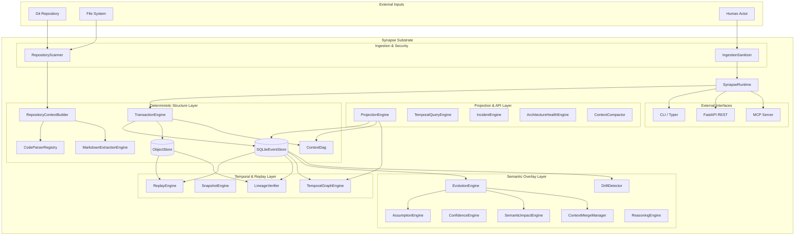

# Synapse Architecture

> **Canonical Architectural Source of Truth — v2.0**
>
> This document is the single authoritative reference for the Synapse system.
> All design decisions, subsystem boundaries, invariants, and guarantees are
> described here. When code and this document conflict, fix one of them.

---

## Table of Contents

1. [Core Idea](#1-core-idea)
2. [System Identity](#2-system-identity)
3. [Problem Statement](#3-problem-statement)
4. [Architectural Boundaries](#4-architectural-boundaries)
5. [The Determinism / AI Boundary](#5-the-determinism--ai-boundary)
6. [High-Level Design (HLD)](#6-high-level-design-hld)
7. [Low-Level Design (LLD)](#7-low-level-design-lld)
8. [Temporal Model](#8-temporal-model)
9. [Replay Model](#9-replay-model)
10. [Lineage Model](#10-lineage-model)
11. [Projection Model](#11-projection-model)
12. [Validation & Confidence Model](#12-validation--confidence-model)
13. [Drift Model](#13-drift-model)
14. [Storage Architecture](#14-storage-architecture)
15. [Runtime Architecture](#15-runtime-architecture)
16. [API Architecture](#16-api-architecture)
17. [Security Architecture](#17-security-architecture)
18. [Context Ingestion Lifecycle](#18-context-ingestion-lifecycle)
19. [Failure Modes & Edge Cases](#19-failure-modes--edge-cases)
20. [Future Direction](#20-future-direction)

---

## 1. Core Idea

### What Synapse Is

Synapse is a **Temporal Source Context Management Substrate and Causal Software Evolution Graph**.

It continuously observes a software repository — its source code structure, markdown documentation, dependency manifests, and Git history — and builds a **replayable, content-addressed, temporally versioned causal graph** of that repository's structural intent.

This context is not a floating or autonomous semantic state. It is derived from **deterministic graph mutation** and **content-addressed structural deltas** backed by an append-only event journal.

### What Category It Belongs To

Synapse sits at the intersection of:

| Existing Category | What Synapse Takes From It |
|---|---|
| Git / Version Control | Append-only journals, DAG history, content-addressed objects |
| Event Sourcing | Immutable event log, state from replay, temporal correctness |
| Knowledge Graphs | Typed nodes, typed edges, semantic relationships |
| Architecture Intelligence | Code understanding, dependency graphs, drift detection |
| Semantic Context Layers | Validation states, assumption tracking, semantic overlays |

Synapse is a **Temporal Source Context Substrate**: a developer and AI agent infrastructure that preserves repository structure, code intent, architectural decisions, and causal evolution through time.

### Why Synapse Exists

Software understanding collapses over time:
- **Understanding decays**: Module structure, intent, and relationships are forgotten or obscured by code churn.
- **Assumptions drift**: Design constraints are violated silently as codebase edits accumulate.
- **Decisions lose context**: The "why" behind code structures is lost without temporal lineage.
- **Cross-cutting drift**: Changes in one module silently invalidate assumptions in dependent modules.

Synapse preserves **structural understanding, temporal evolution, and architectural intent** as first-class, versioned, replayable context.

---

## 2. System Identity

```
Synapse is NOT:
  ✗ an "AI operating system"
  ✗ a "cognitive OS"
  ✗ an autonomous cognitive engine
  ✗ a floating confidence/agent loop
  ✗ an onboarding chatbot

Synapse IS:
  ✓ a temporal source context management substrate
  ✓ a causal software evolution graph
  ✓ a Git-native context runtime
  ✓ a deterministic replay-driven understanding engine
  ✓ a validation-state context overlay runtime
```

**Core principle**: `understanding through time`.

---

## 3. Problem Statement

### The Decaying Understanding Problem

Software systems accumulate understanding debt. Git preserves *what code changed*, but it does not preserve *why it matters* or *what design constraints were assumed true* at the moment of the commit. Synapse bridges this gap by mapping AST-extracted structures, documentation headings, and commit history into a single causal timeline.

### The Untracked Assumption Problem

Architectural assumptions are made implicitly. When code evolves, these assumptions are violated silently. Synapse formalizes assumptions as first-class semantic annotations with validity windows linked directly to AST structures.

### The Invisible Drift Problem

Documentation drifts from code reality. By comparing the current filesystem state against the last indexed context head, Synapse makes architectural drift visible and measurable.

---

## 4. Architectural Boundaries



---

## 5. The Determinism / AI Boundary

The boundary between deterministic structural truth and probabilistic semantic overlays is absolute.

```
┌──────────────────────────────────────────────────────────┐
│              DETERMINISTIC STRUCTURAL TRUTH              │
│       (AST/LSP extraction, commit lineage, hashing)       │
│                                                          │
│  ContextObject  EventRecord  GraphNode/Edge  ObjectStore │
└────────────────────────────┬─────────────────────────────┘
                             │
                      read-only access
                             ▼
┌──────────────────────────────────────────────────────────┐
│            PROBABILISTIC SEMANTIC INTERPRETATION         │
│          (AI annotations, summaries, explanations)       │
│                                                          │
│  ValidationState (Validated/Assumed/Invalidated)         │
│  Heuristics, Provenance, Metadata overlays               │
└──────────────────────────────────────────────────────────┘
```

### Deterministic Structural Truth
The substrate owns **structural truth**. This includes AST symbol extraction, filesystem scans, Git commit lineage, and transaction logging. No AI is ever allowed to define graph nodes, rewrite dependency lineage, or dictate transaction truth. Given the same repository filesystem state, this layer must produce the identical, deterministic content-addressed hash.

### Semantic Interpretation Layer (AI Overlay)
AI models are treated as **semantic overlay engines**. AI may summarize drift, annotate structures, infer assumptions, or narrate evolution. Every AI-generated output must carry model metadata, timestamps, and provenance, and remains completely invalidatable. It cannot mutate structural records.

---

## 6. High-Level Design (HLD)

Synapse is structured into five core, sequential architectural layers:

```
┌───────────────────────────────────────────────────────────────────────────┐
│ 1. DETERMINISTIC INGESTION LAYER                                          │
│    RepositoryScanner ──> CodeParserRegistry (AST) ──> stable_hash (SHA256)│
└─────────────────────────────────────┬─────────────────────────────────────┘
                                      ▼
┌───────────────────────────────────────────────────────────────────────────┐
│ 2. TEMPORAL GRAPH STORAGE                                                 │
│    SQLiteEventStore (WAL, indexes) + ObjectStore (content-addressed msgpack)│
└─────────────────────────────────────┬─────────────────────────────────────┘
                                      ▼
┌───────────────────────────────────────────────────────────────────────────┐
│ 3. RETRIEVAL PIPELINE                                                     │
│    1. Temporal Filtering ──> 2. Structural Traversal ──> 3. Semantic Recall│
└─────────────────────────────────────┬─────────────────────────────────────┘
                                      ▼
┌───────────────────────────────────────────────────────────────────────────┐
│ 4. SEMANTIC INFERENCE LAYER                                               │
│    Stateless, lazy-evaluated validation checks & AI annotations           │
└─────────────────────────────────────┬─────────────────────────────────────┘
                                      ▼
┌───────────────────────────────────────────────────────────────────────────┐
│ 5. PROJECTION / UI / API LAYER                                            │
│    Materialized ProjectionGraphs, Replay Visualizer, REST & MCP endpoints │
└───────────────────────────────────────────────────────────────────────────┘
```

### 1. Deterministic Ingestion Layer
Observes repository structure. Parses files via tree-sitter or regex-based registries, extracts AST symbols and imports, parses markdown heading paths, and normalizes them. The resulting dictionary is converted to msgpack and hashed via SHA-256 (`stable_hash`).

### 2. Temporal Graph Storage
Maintains the append-only journal of events. Merges structural updates into `ContextObject` deltas. Writes raw blocks to zlib-compressed object files and registers their metadata, active heads, and parent-child lineages in SQLite WAL indexed tables.

### 3. Retrieval Pipeline
Enforces a strict evaluation order to prevent probabilistic hallucinations from contaminating structural relationships:
1. **Temporal Filtering**: Selects active contexts based on the ancestor set of a target context hash.
2. **Structural Traversal**: Traverses code dependencies, containment chains, and references via graph query.
3. **Semantic/Vector Retrieval**: Queries text/vector indexes within the temporal and structural bounds returned by steps 1 and 2.

### 4. Semantic Inference Layer
Computes validation state changes, evaluates assumption staleness, and overlays AI summaries. This layer is stateless and lazy-evaluated on query.

### 5. Projection/UI/API Layer
Generates user-facing projections, manages the web interface, and exposes tool schemas over REST and MCP.

---

## 7. Low-Level Design (LLD)

### Core Primitives

The core primitive of Synapse history is the **Content-Addressed Structural Delta**. Instead of tracking the complete graph state in every commit, the system registers only the nodes, edges, and semantic annotations modified by a transaction.

- **Node Identity**: Every `GraphNode` has a content-derived `stable_id` (e.g. hash of kind and file path).
- **Lineage Identity**: Every `ContextObject` has an `object_hash` (SHA-256 of its canonical msgpack serialization).
- **Lineage DAG**: Built dynamically in `context_edges` showing child -> parents mapping.
- **Validity Intervals**: Tracks `[valid_from_context, valid_to_context]`. A node is active if its validity interval is open within the context's ancestry.

### Immutability vs. Derivability

| Primitive / Cache | State Classification | Mutability | Replayable |
|---|---|---|---|
| `EventRecord` | Primary Event Log | Immutable | Yes |
| `ContextObject` | Primary Structural Delta | Immutable | Yes |
| `ObjectStore` Blobs | Primary Storage | Immutable | Yes |
| `SQLiteEventStore` Tables | Structural Indexes | Mutable | Reconstructible |
| `ProjectionGraph` | Derived View | Cache | Reconstructible |
| `ValidationState` | Inferred Overlay | Dynamic | Reconstructible |

---

## 8. Temporal Model

### Temporal Validity
Every semantic annotation, graph node, and edge carries:
- `valid_from_context`: the context hash where the element was introduced.
- `valid_to_context`: the context hash where the element was removed, updated, or invalidated.

### Temporal Graph Reconstruction
To construct the active graph at `context_hash`:
1. Walk the ancestry DAG backwards from `context_hash` to retrieve the set of valid ancestor contexts.
2. Load all structural deltas associated with these ancestor contexts.
3. Apply deltas in forward topological order.
4. If an element's `valid_to_context` is present in the ancestry set, remove it from the active graph.

---

## 9. Replay Model

### Bounded Replay Semantics
Replay is **bounded** and **diagnostic**. It reconstructs historical context state from a known checkpoint rather than rebuilding the entire database from genesis on every run:

```
[Genesis] ──> [Event sequence 1...N] ──> [Checkpoint Snapshot] ──> [Recent Events] ──> [Active Head]
                                                │                     │
                                                └── Skip playback ────┴── Replay delta only
```

1. Locate the latest verified `Snapshot` checkpoint.
2. Read the stored `state_hash` and the list of active objects from the snapshot.
3. Playback the event log from the snapshot's event sequence up to the active HEAD.
4. Verify zlib msgpack checksums for each played delta in the `ObjectStore`.
5. Recalculate the overall `state_hash` and assert equality with the target head hash.

---

## 10. Lineage Model

### Lineage Verification
The `LineageVerifier` performs the equivalent of a Git fsck check over the causal graph:
- **Object Integrity**: Asserts that every context registered in SQLite has a matching file in `.synapse/objects/` that hashes correctly.
- **Lineage Integrity**: Walks the parent graph via depth-first search to ensure there are no cycles and all active heads connect back to the genesis block.
- **Reference Integrity**: Verifies that no edge references a missing node, and no semantic annotation is orphaned.

---

## 11. Projection Model

Projections are read-side materialized views generated dynamically by the `ProjectionEngine` and cached in `projection_cache`.

### Graph Compaction & Bounds
To maintain responsiveness under large codebases:
- **Clustering**: If node count exceeds 80, file-level nodes collapse under directory-level nodes.
- **Hard Cap**: If the graph still exceeds 150 nodes, low-trust or stale nodes are dropped.
- **Compaction**: Sequential redundant history records are merged, and contexts older than the most recent 100 are migrated to cold database tables.

---

## 12. Validation & Confidence Model

Synapse replaces floating-point "truth confidence" with a deterministic **Tristate Validation State**:

```
                  ┌──────────────────────┐
                  │      VALIDATED       │  ◄── Provenance Verified / Human approved
                  └──────────┬───────────┘
                             │
                             ▼ (Time decay / drift detected / low evidence)
                  ┌──────────────────────┐
                  │       ASSUMED        │
                  └──────────┬───────────┘
                             │
                             ▼ (Validity window closed / contradicts edge)
                  ┌──────────────────────┐
                  │     INVALIDATED      │
                  └──────────────────────┘
```

1. **Validated**: Facts verified by human note, compiler checks, or high-trust structural evidence.
2. **Assumed**: Probabilistic inferences, third-party model annotations, or facts with decayed temporal freshness.
3. **Invalidated**: Facts whose validity window has closed, referenced sources have disappeared, or contradiction relationships are established.

### Numeric Scoring (Secondary Heuristics)
Floating-point confidence scores [0.0, 1.0] are retained **only** as secondary heuristic metadata for node ranking and decay tracking. They are calculated dynamically using freshness, trust weights, and contradiction penalties, but do not represent architectural truth.

---

## 13. Drift Model

Drift is the divergence between the current file system reality and the last indexed context head.
- **Modified files**: Differing hashes are flagged as drifted.
- **Instability Score**: The rate of change. A high instability score indicates that the codebase is changing faster than it is being indexed, signifying that the semantic overlays may be out-of-date.

---

## 14. Storage Architecture

### Two-Store Model
- **SQLite WAL**: Tracks transaction logs, active heads, current projections, and fast indexes.
- **Object Store**: Holds raw msgpack objects compressed with zlib. If SQLite is corrupted, it can be rebuilt by replaying the object store.

### Zero-Copy Branching
When a new Git branch is created, Synapse creates a new active head pointer pointing to the current context hash. No data is duplicated. The new branch inherits the entire context lineage DAG of the parent branch instantly.

---

## 15. Runtime Architecture

`SynapseRuntime` is the application coordinator. It manages the filesystem Watchdog, boots the transaction journal, runs the polling loop to watch for HEAD changes, and triggers the compaction pipeline.

---

## 16. API Architecture

Exposes a REST API (`api/app.py`) for visualization, and an MCP server (`mcp/server.py`) for AI tools. Projections are computed on demand, cached, and returned as JSON.

---

## 17. Security Architecture

### Ingestion Hardening
All inputs pass through the `IngestionSanitizer`:
- **Jailbreak Detection**: Scans manual notes and markdown for LLM command injection strings.
- **Path Traversal Protection**: Enforces subdirectory containment using Python's `Path.relative_to` to prevent directory traversal.
- **HMAC Signatures**: Signs context hashes with HMAC-SHA256 to ensure lineage authenticity.

---

## 18. Context Ingestion Lifecycle

```
1. SCANNING
   RepositoryScanner.scan() ──> File System reality
   
2. DETERMINISTIC PARSING
   CodeParserRegistry parses AST imports and structure
   MarkdownExtractionEngine parses markdown heading structure
   
3. MUTATION BUILDING
   RepositoryContextBuilder generates GraphNode, GraphEdge, and SemanticObject deltas
   
4. TRANSACTION WRITING
   TransactionEngine journals write, compresses blobs, updates SQLite index,
   sets new branch active head, and clears the projection cache
   
5. CACHED PROJECTION
   ProjectionEngine builds materialized view, clusters if >80 nodes,
   and saves graph representation in projection_cache
```

---

## 19. Failure Modes & Edge Cases

- **Replay Divergence**: If the replayed state hash does not match, a warning is raised and the operator is advised to rebuild indexes.
- **Locked Database**: Solved by setting WAL mode and 30-second query timeout.
- **Compaction Conflict**: Foreign keys are removed from `context_edges` to allow archiving context rows to cold storage without disrupting active DAG walks.

---

## 20. Future Direction

- **Incremental AST indexing**: Parse only modified files on Git HEAD change.
- **Semantic Overlay APIs**: Enable external agents to register custom, versioned annotations on top of structural nodes.
- **Temporal Diffing Visualizer**: Render graph changes (additions/deletions) directly in the UI.

---

## Appendix A: Invariant Summary

- **Lineage Integrity**: Parent-child edges must form a directed acyclic graph.
- **Atomic Writes**: Transactions must be journaled and recover cleanly on startup.
- **No Mutative AI**: Probabilistic models may never write structural elements.

## Appendix B: Glossary

- **Temporal Source Context Substrate**: The local runtime managing event logs and lineage.
- **Causal Software Evolution Graph**: The projected network of structural code elements and semantic overlays.
- **Semantic Annotation**: A markdown, git, or AI-generated note describing architectural intent.
- **Validation State**: Tristate (`Validated`, `Assumed`, `Invalidated`) representing fact certainty.
