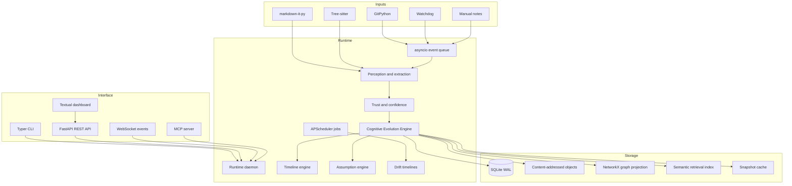
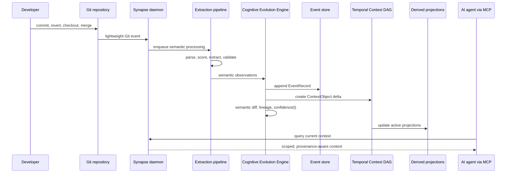

# Architecture

Synapse is a layered local runtime. Its central invariant is simple: **durable cognition is append-only, provenance-aware, temporally valid, and tied to Git history**.

## System Layers

## Core Data Flow

## Source Of Truth

The source of truth is the combination of:

- append-only `EventRecord` rows in SQLite;
- immutable content-addressed cognition objects;
- Context DAG lineage;
- Git commit references and provenance records.

Graph and retrieval indexes are derived views. Snapshots are acceleration artifacts. They may be rebuilt from events and objects.

## Bounded Contexts

- **Runtime:** process lifecycle, queues, scheduling, daemon mode.
- **Cognition:** extraction, semantic objects, relevance, confidence, compression, drift.
- **Evolution:** semantic diffs, timelines, assumption invalidation, confidence evolution, branch divergence, cognitive replay.
- **Replay:** deterministic reconstruction, replay diagnostics, lineage reconstruction, checkpoint-aware state hashes.
- **Transactions:** journaled event/object/context writes and interrupted transaction recovery.
- **Lineage:** `git fsck`-style validation for cognition DAG ancestry and active heads.
- **Storage:** SQLite, object store, graph projections, semantic retrieval indexes, snapshots.
- **Git:** commit linkage, branch cognition, rollback, merge semantics.
- **MCP/API:** controlled exposure to tools and agents.
- **Security:** trust model, permissions, context poisoning protection.

## Runtime Modes

- `idle`: watches for cheap events and serves context.
- `active`: processes recent commits and documentation updates.
- `indexing`: performs deeper AST and semantic enrichment.
- `low-power`: defers heavy embedding and graph compaction work.
- `replay`: reconstructs state deterministically from event history.

## Consistency Invariants

- Event processing must be idempotent.
- Context objects are immutable.
- Context DAG edges are never rewritten; supersession is represented by new events.
- Every durable semantic fact has provenance and confidence.
- Every durable semantic fact has temporal validity and can participate in confidence(t).
- Retrieval indexes never decide truth.
- Branch merges that affect cognition must surface conflicts explicitly.
- Replay, lineage verification, and transaction journals must agree before derived projections are trusted.

## Failure Model

Synapse assumes local process crashes, interrupted indexing, Git history rewrites, stale docs, conflicting branch facts, corrupted cache files, and malicious or low-trust notes. Recovery is replay-first: rebuild derived state from the event store and object store, then invalidate any cache that cannot prove its state hash.
