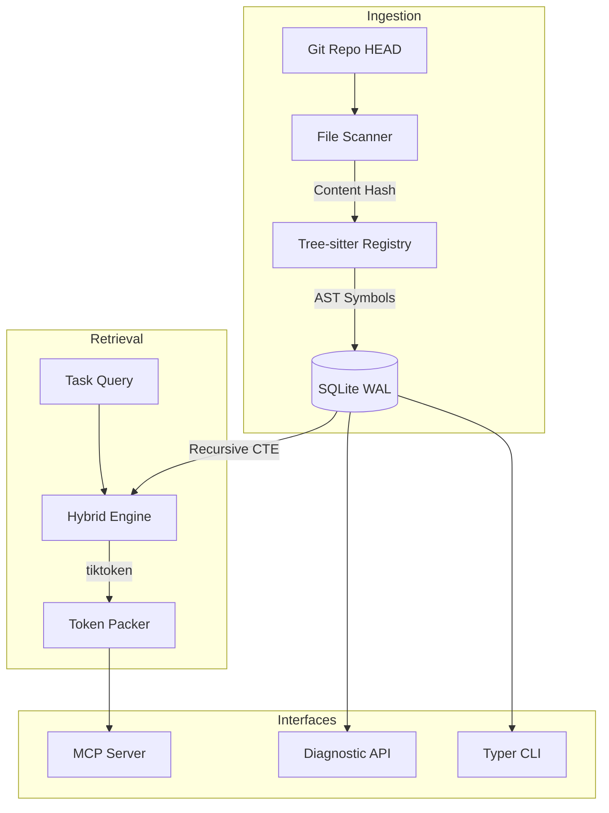

# Synap Architecture

Synap is a **deterministic structural context substrate** designed for AI coding agents. It provides a stable, verifiable memory layer by projecting Git repository states into a searchable structural graph.

## System Overview

Synap operates as a pure projection engine. It does not "guess" code structure using AI; it extracts it deterministically using **Tree-sitter** parsers and **Recursive SQL** traversals.

---

## 1. Deterministic Grounding

The fundamental invariant of Synap is Git grounding:
- Tied symbols: Every symbol is bound to a specific Git commit OID and file content hash.
- Pure state: The system state is a pure projection of the Git working tree.
- Identical rebuilds: Wiping the local database and rebuilding always produces identical results.

## 2. Ingestion Pipeline

Synap indexes the repository through the following steps:
1.  **Code scan**: Detects modified files via SHA-256 content hashes.
2.  **AST extraction**: Traverses grammar structures via Tree-sitter parsers to collect symbols and dependency edges.
3.  **Database storage**: Writes the structural code graph within a single WAL-mode transaction.

## 3. Storage Layer

Synap writes all metadata to local files:
- **SQLite Database**: Persists files, symbols, edges, checkpoints, decisions, activities, and lessons under `.synap/synap.db`.
- **JSON Trace Log**: Records the latest retrieval trace under `.synap/trace_latest.json`.

## 4. Hybrid Retrieval Engine

Retrieval uses four evaluation phases:
1.  **Temporal filtering**: Excludes symbols not associated with the active branch or commit.
2.  **Structural expansion**: Extracts neighboring nodes using SQLite Recursive CTEs.
3.  **Lexical matching**: Evaluates keyword targets via SQLite FTS5 search queries.
4.  **Semantic ranking**: Boosts matching candidate scores if symbol names contain query words.

## 5. Model Context Protocol (MCP)

Synap operates as an MCP server. It exposes its core capabilities through standard protocol commands, allowing AI agents to perform grounded repository analysis.

---

## 6. Diagnostic Observability

Synap generates diagnostic tracing for every query:
- Explains which symbols were selected and why (lexical vs structural).
- Tracks the token weight of each context block.
- Records the truncation decisions made to fit within the token budget.
