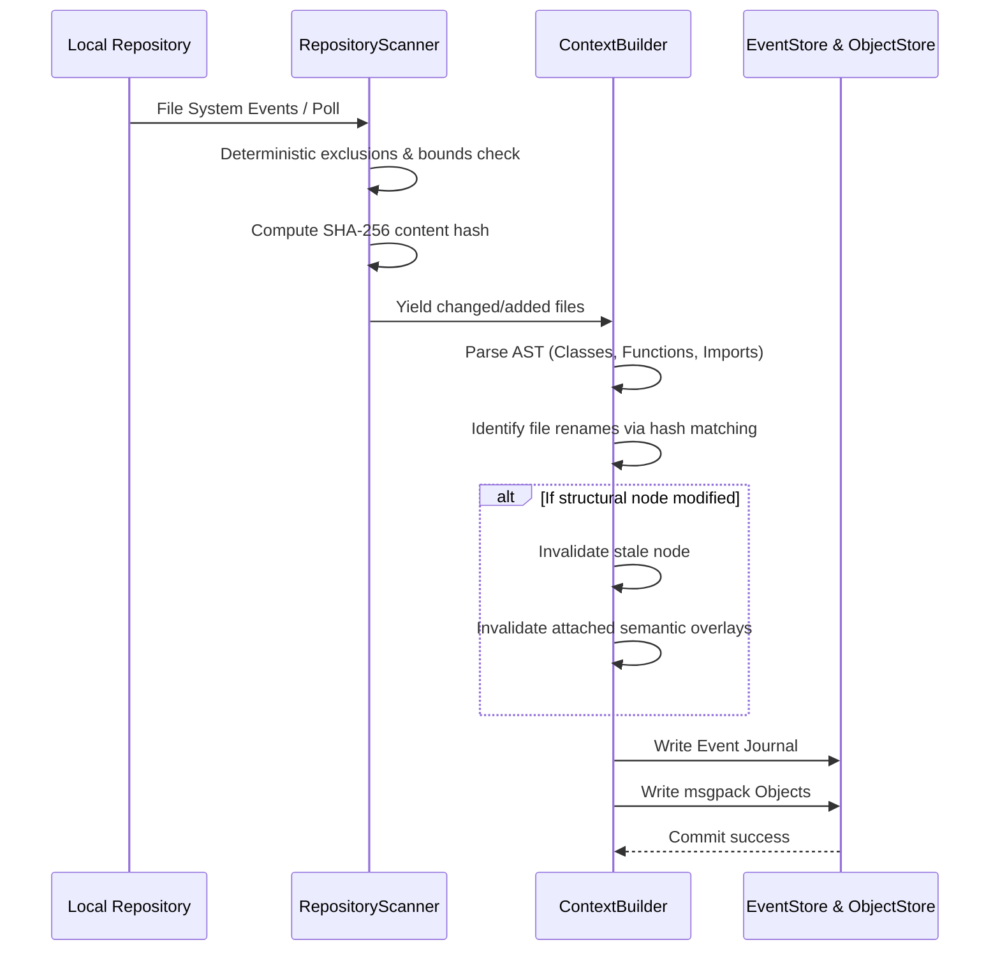
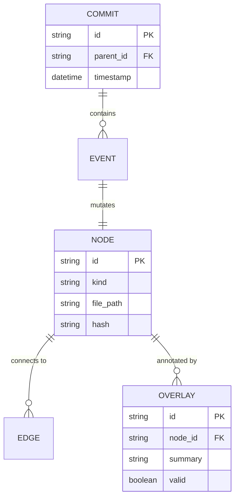

# Synapse Architecture

Synapse is a **persistent structural context infrastructure** designed specifically for AI coding agents.

Unlike traditional RAG (Retrieval-Augmented Generation) systems that rely on naive text chunking and vector similarity, Synapse treats the codebase as a deterministically bounded structural graph. It maps packages, modules, classes, and functions, and records their evolution over time using an event-sourced architecture.

## System Overview

Synapse does **not** use AI to define structural truth. Parsers, Git state, content hashes, SQLite transactions, and object-store integrity checks own the durable state. AI providers may optionally summarize, annotate, and explain already extracted context through **semantic overlays**.

*(Note: The diagram above illustrates logical data flow. The actual implementation runs within a unified Python runtime.)*

---

## 1. Incremental Ingestion Pipeline

The ingestion pipeline transforms raw repository files into versioned structural context. It is designed to be incremental, bounded, and fast.

### Core Responsibilities
- **`RepositoryScanner`**: Walks the repository applying deterministic exclusions (e.g., ignoring binaries, overly large files, hidden directories) and computes SHA-256 hashes.
- **Renames & Moves**: Handled by matching deleted and added files with identical content hashes.
- **Invalidation**: Modified files immediately invalidate their structural nodes, parsed symbols, and attached semantic overlays.

---

## 2. Structural Extraction & The Context Graph

Synapse maintains a purposely constrained structural graph. It does not track variables, per-line AST nodes, or speculative reasoning.

**Nodes Tracked:**
- Packages and module boundaries
- Files and Documents (Markdown)
- Classes and Functions
- Import Dependencies

By bounding the graph, Synapse avoids graph explosion and ensures retrieval queries return high-signal context.

---

## 3. Durable Storage Layer

The storage layer guarantees local-first reliability using a two-part system:

1. **`ObjectStore`**: Immutable `msgpack` objects compressed with `zlib` and addressed by their SHA-256 hash.
2. **`SQLiteEventStore`**: WAL-enabled SQLite tables tracking events, context commits, active heads, structural nodes/edges, and semantic projections.

Context writes are orchestrated by the `ContextTransactionEngine`, which journals event payloads. If an ingestion cycle is interrupted, the transaction fails atomically, and replay diagnostics (`synapse doctor`) maintain integrity.

---

## 4. Hybrid Retrieval Flow

When an agent or developer requests context, Synapse executes a bounded, four-stage hybrid retrieval pipeline.

```mermaid
flowchart TD
    Req[Context Request] --> TFilter[1. Temporal Filtering]
    
    subgraph Pipeline
    TFilter -->|Active Head| STraverse[2. Structural Traversal]
    STraverse -->|Bounded Nodes| SRecall[3. Semantic Recall]
    SRecall -->|Ranked Nodes| LLMSynth[4. LLM Synthesis]
    end
    
    LLMSynth --> Resp[Agent Context Window]
    
    classDef step fill:#1e293b,stroke:#8b5cf6,stroke-width:2px;
    class TFilter,STraverse,SRecall,LLMSynth step;
```

1. **Temporal Filtering**: Reconstructs the active context at a chosen context head (ignoring stale or deleted nodes).
2. **Structural Traversal**: Finds matching nodes based on query parameters and expands through nearby dependency edges (up to a hard node limit).
3. **Semantic Recall**: Uses keyword and local embedding similarity to rank active semantic objects.
4. **LLM Synthesis** *(Optional)*: Synthesizes a natural language answer from the packed, cited context only, avoiding hallucination.

---

## 5. Semantic Overlays

Semantic overlays are non-destructive AI annotations attached to structural nodes. They provide human-readable summaries or developer notes. 

**Crucial Invariant**: Overlays cannot mutate structural nodes or create dependencies. If the underlying code is modified, the overlay is automatically invalidated by the ingestion pipeline until it is re-generated.

---

## 6. Runtime & Agent Interfaces

Synapse exposes its engine through several interfaces:
- **Typer CLI**: `init`, `status`, `search`, `rollback`, `doctor`.
- **FastAPI**: REST endpoints for context status, timelines, and raw projections.
- **Context UI**: A lightweight D3-based visualizer for the context graph and historical timeline.
- **SynapseMCPFacade**: Implementation of the Model Context Protocol (MCP). Exposes tools to agents (e.g., `get_current_context`, `search_context`, `explain_structure`).
