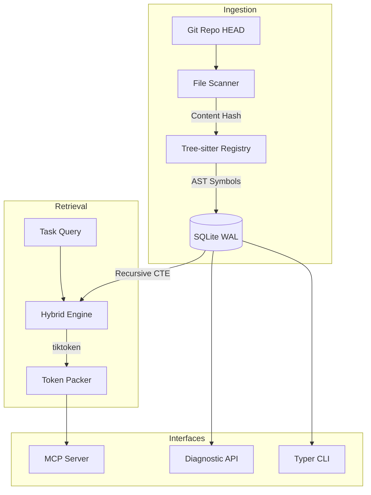

# Synap Architecture

Synap is a deterministic, Git-aware structural context engine. It provides a stable, verifiable memory layer by projecting Git repository states into a searchable structural graph and serving it via the Model Context Protocol (MCP).

## System Overview

Synap operates as a pure projection engine. It does not synthesize code structure using AI; it extracts it deterministically using Tree-sitter parsers and Recursive SQL traversals.



---

## 1. The Git-Snapshot Model

Unlike standard indexers that run background file system watchers or compute arbitrary hashes, Synap uses Git commits as the absolute source of truth. Every repository state is defined as a projection of the active Git commit.

- **Projections**: The codebase index is a pure function of your Git history and active tree. Switching branches or checking out older commits shifts the context instantly.
- **Change detection**: Synap does not perform full filesystem scans or read all files on incremental updates. It uses `git diff-tree` to identify changed paths, reading only modified files.
- **Preservation through rollbacks**: While the structural code index swaps with the active Git commit, L3 behavioral memories (lessons) are preserved and carry forward.

---

## 2. The 3-Layer Context Model

Synap provides context across three decoupled layers to ground the coding agent:

```
┌─────────────────────────────────────────────────────────┐
│              L3: Behavioral Memory                      │
│      (Checkpoints, Decisions, Revert Lessons)           │
├───────────────────────────┬─────────────────────────────┤
│                             │ (Injected into)             │
┌───────────────────────────▼─────────────────────────────┐
│              L2: Semantic Documentation                 │
│         (File/Module Wikis, Project Overview)           │
├───────────────────────────┬─────────────────────────────┤
│                             │ (Linked to)                 │
┌───────────────────────────▼─────────────────────────────┐
│              L1: Structural Symbol Graph                │
│       (Tree-sitter parsed classes, functions, edges)    │
└─────────────────────────────────────────────────────────┘
```

### Layer 1: Structural Index (L1)
L1 is a deterministic mapping of codebase architecture. It extracts programming language symbols (classes, functions, methods) and parses imports to determine call and dependency edges.
- **Tree-sitter parsing**: Extracts code nodes with high AST fidelity.
- **Symbol identification**: Maps every symbol by a primary key of `sha256(path + content_hash)` to eliminate duplication and collision.
- **SQLite graph traversal**: Stores relations and call dependencies in an SQL schema, traversed dynamically using SQLite Recursive Common Table Expressions (CTEs).

### Layer 2: Semantic Documentation (L2)
L2 provides human-readable context in the form of markdown summaries. It represents file, module, and project descriptions stored under `.synap/wiki/`.
- **Worker task**: Decouples slow, non-deterministic LLM wiki generation from the indexing pipeline. The daemon enqueues tasks to a persistent queue (`wiki_queue`) and processes them in the background.
- **Cache fallback**: Triggers a synchronous generation pass to update the cache on the fly if the CLI, Web API, or MCP tools request an ungenerated or stale wiki page.

### Layer 3: Behavioral Memory (L3)
L3 represents developer-in-the-loop memory that captures current tasks, design patterns, and past failures.
- **Checkpoints**: Captures the state snapshot containing the active task description (`doing`), files affected, next steps, and blockers.
- **Decisions**: Logs technical and architectural decisions made by the agent.
- **Lessons**: Evaluates and stores rules generated automatically when a commit is reverted (detected via the Git commit ancestor graph). Active, approved lessons are prepended as system instructions during agent context packaging.

---

## 3. Ingestion Pipeline

Synap indexes the repository through the following steps:
1. **Code scan**: Detects modified files via SHA-256 content hashes.
2. **AST extraction**: Traverses grammar structures via Tree-sitter parsers to collect symbols and dependency edges.
3. **Database storage**: Writes the structural code graph within a single WAL-mode transaction.

---

## 4. Storage Layer

Synap writes all metadata to local files:
- **SQLite Database**: Persists files, symbols, edges, checkpoints, decisions, activities, and lessons under `.synap/synap.db`.
- **JSON Trace Log**: Records the latest retrieval trace under `.synap/trace_latest.json`.

---

## 5. Hybrid Retrieval Engine

Retrieval uses four evaluation phases:
1. **Filter phase**: Excludes symbols not associated with the active branch or commit.
2. **Expansion phase**: Extracts neighboring nodes using SQLite Recursive CTEs.
3. **Matching phase**: Evaluates keyword targets via SQLite FTS5 search queries.
4. **Ranking phase**: Boosts matching candidate scores if symbol names contain query words.

---

## 6. Model Context Protocol (MCP)

Synap operates as an MCP server. It exposes its core capabilities through standard protocol commands, allowing AI agents to perform grounded repository analysis.

---

## 7. Diagnostic Observability

Synap generates diagnostic tracing for every query:
- Explains which symbols were selected and why (lexical vs structural).
- Tracks the token weight of each context block.
- Records the truncation decisions made to fit within the token budget.
