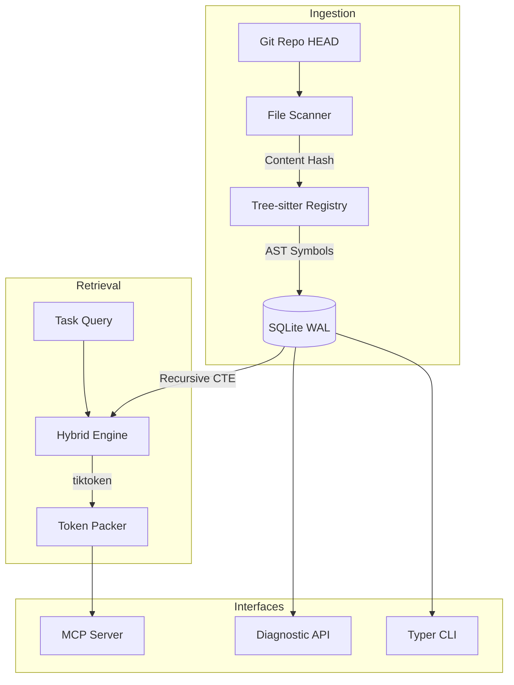

# Synap Architecture

Synap is a **deterministic structural context substrate** designed for AI coding agents. It provides a stable, verifiable memory layer by projecting Git repository states into a searchable structural graph.

## System Overview

Synap operates as a pure projection engine. It does not "guess" code structure using AI; it extracts it deterministically using **Tree-sitter** parsers and **Recursive SQL** traversals.

---

## 1. Deterministic Grounding

The fundamental invariant of Synap is **Git Grounding**.
- Every indexed symbol is tied to a specific Git commit OID and file content hash.
- The system state is a pure function of the Git working tree.
- Wiping the local index and rebuilding it always produces identical results.

## 2. Ingestion Pipeline

Synap implements a highly optimized incremental indexing pipeline:
1.  **Fast Scan**: Identifies changed files using SHA-256 content hashes.
2.  **Tree-sitter Parsing**: Extracts high-fidelity symbols (Classes, Functions, Interfaces) and structural relationships (Imports, Call Edges).
3.  **Atomic Persistence**: Updates the SQLite index within a single WAL-mode transaction.

## 3. Storage Layer

Synap uses a simple, infrastructure-grade storage model:
- **SQLite (Primary Index)**: Stores files, symbols, edges, and retrieval traces.
- **Zlib Object Store**: Git-like content-addressed storage for immutable file snapshots.

## 4. Hybrid Retrieval Engine

Retrieval is executed in a strict 4-stage priority order:
1.  **Temporal**: Filter by active branch and recent commits.
2.  **Structural**: Expand search from keywords to neighbors using SQL Recursive CTEs.
3.  **Lexical**: Sub-millisecond keyword matching via SQLite FTS5.
4.  **Semantic**: concepts-based reranking using vector similarity (Optional).

## 5. Model Context Protocol (MCP)

Synap is an **MCP-first** platform. It exposes its core capabilities through standard Model Context Protocol tools, allowing any AI agent (Cursor, Claude, Roo) to perform grounded repository analysis.

---

## 6. Diagnostic Observability

Synap prioritizes **Explainable AI**. Every retrieval operation generates a persistent **Diagnostic Trace**, recording:
- Which symbols were selected and why (lexical vs structural).
- The token weight of each context block.
- The specific truncation decisions made to fit within the agent's window.
