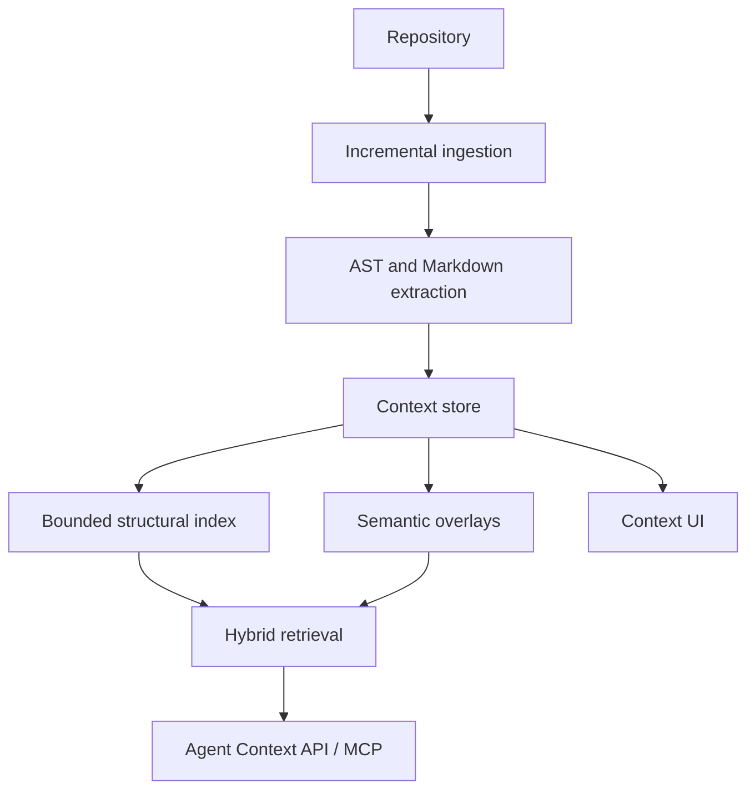

# Synapse Architecture

Synapse is persistent structural context infrastructure for AI coding agents. It indexes a local repository, stores versioned structural context, and returns grounded context windows through CLI, API, UI, and MCP-facing helpers.

Synapse does not use AI to define structural truth. Parsers, Git state, content hashes, SQLite transactions, and object-store integrity checks own the durable state. AI providers may summarize, annotate, and explain already extracted context through semantic overlays.

## System Shape

## Core Components

### Incremental Ingestion

`RepositoryScanner` walks the repository with deterministic exclusions, file-size bounds, manifest discovery, language detection, and SHA-256 content hashes. `RepositoryContextBuilder` converts scans into context deltas.

Ingestion handles renames by matching deleted and added files with identical content hashes. Modified and deleted files invalidate their structural nodes, parsed symbols, semantic summaries, and attached overlays in the next context commit.

### Structural Extraction

The structural index is intentionally small. It tracks:

- packages and folder boundaries
- files and modules
- Markdown documents
- classes and functions
- import dependencies

It does not track variables, expressions, tokens, per-line AST nodes, incidents, assumption graphs, or speculative reasoning objects.

### Context Store

The storage layer uses two local stores:

- `ObjectStore`: immutable msgpack objects compressed with zlib and addressed by SHA-256.
- `SQLiteEventStore`: WAL-enabled SQLite tables for events, context commits, active heads, structural nodes, structural edges, semantic objects, snapshots, projections, and transaction journals.

Context writes go through `ContextTransactionEngine`, which journals event payloads and context objects so interrupted writes can be marked failed and replay diagnostics remain meaningful.

### Bounded Replay

Replay is diagnostic and snapshot-assisted. It verifies object hashes, event payloads, context lineage, and active heads. It is not an always-on reasoning layer and does not reconstruct speculative historical universes.

### Hybrid Retrieval

Retrieval follows a bounded four-stage flow:

1. Temporal filtering reconstructs active context at a chosen context head.
2. Structural traversal finds matching nodes and expands through nearby edges with hard node limits.
3. Semantic recall ranks active semantic objects with keyword and embedding similarity.
4. LLM synthesis answers from packed, cited context only.

### Semantic Overlays

Semantic overlays are annotations attached to structural nodes. They can summarize, explain, or add developer-provided notes. They cannot mutate structural nodes or create dependencies. If the target node is modified or removed, the overlay is invalidated by ingestion.

### Agent/API/UI Layer

The runtime exposes:

- Typer CLI commands for init, status, search, rollback, doctor, and UI startup.
- FastAPI endpoints for status, timeline, projection, and notes.
- `SynapseMCPFacade` tools for current context, context diffs, search, task context, structure explanation, and related structural context.
- A lightweight D3 UI for overview, subsystem, history, and context comparison views.

## Invariants

- Same repository content produces the same structural hashes.
- AI output is never structural truth.
- Context commits are append-only.
- Structural nodes and overlays are invalidated, not patched in place.
- Retrieval output is bounded by traversal limits and token budgets.
- SQLite is local-first and runs in WAL mode.
- Object-store corruption is surfaced by `synapse doctor`.
