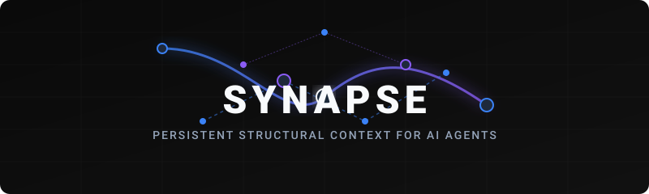
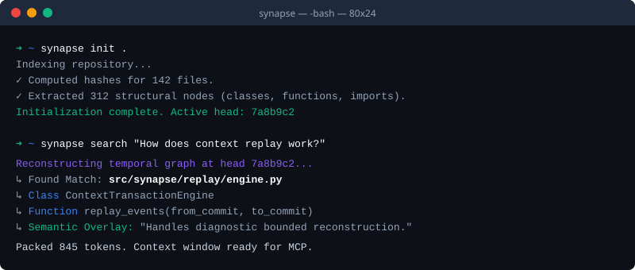
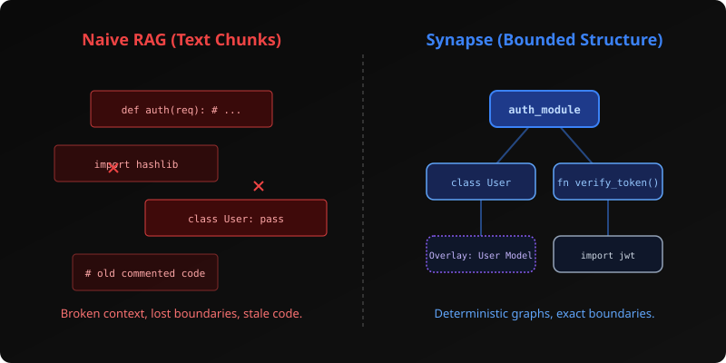
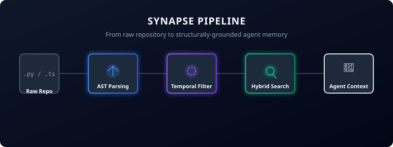
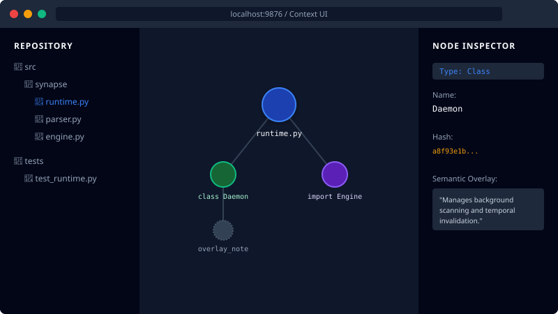

<p align="center">
  
</p>

<p align="center">
  <b>Persistent structural context infrastructure for AI coding agents.</b>
</p>

<p align="center">
  <a href="https://github.com/synapse/synapse/actions"></a>
  <a href="https://pypi.org/project/synapse-core/"></a>
  <a href="https://pypi.org/project/synapse-core/"></a>
  <a href="https://github.com/astral-sh/ruff"></a>
  <a href="LICENSE.md"></a>
</p>

---

**Synapse** is a local-first service that indexes your repository, extracts its bounded structure (modules, classes, functions, imports), and stores versioned context. It exposes this structurally-grounded truth to AI agents via CLI, REST APIs, and the [Model Context Protocol (MCP)](https://modelcontextprotocol.io/).

AI agents lose repository understanding over time. Token windows fill up with stale chats, and search relies on naive text embeddings. Synapse fixes this by giving agents **persistent, structurally-aware, and temporally-accurate** context retrieval.

---

## Quick Install & First Run

Synapse requires Python 3.10+ and uses `uv` for lightning-fast installation. Here is the absolute fastest way to get started:

### 1. Install
```bash
uv tool install synapse-core
```

### 2. Initialize
```bash
synapse init .
```

### 3. Start Background Runtime
```bash
synapse start .
```

### 4. Open UI
```bash
synapse ui .
```

### 5. Ask Structural Questions
```bash
synapse search "How does context replay work?"
```

---

## Example Developer Workflow

Synapse provides an instant, grounded retrieval window right in your terminal.

<p align="center">
  
</p>

---

## Why Synapse?

Text embeddings are blind to module boundaries, resulting in unstructured, disjointed snippets. Synapse replaces this with **Bounded Structure**.

<p align="center">
  
</p>

| Naive RAG / Embedding Search | Synapse Structural Context |
| :--- | :--- |
| Blind to module boundaries and file history. | Knows exactly where functions, classes, and modules begin and end. |
| Returns unstructured, disjointed text snippets. | Returns bounded structural subgraphs and deterministic lineage. |
| Overwrites context; loses the "why" behind changes. | Uses WAL-enabled SQLite + Object Store for temporal history and snapshots. |
| Slow, cloud-dependent. | Fast, local-first, runs entirely on your machine. |

---

## How it Works

Synapse does **not** use AI to define structural truth. Parsers, Git state, content hashes, and SQLite transactions own the durable state. AI providers optionally summarize or explain the extracted context through non-destructive **semantic overlays**.

<p align="center">
  
</p>


---

## Context UI Explorer

Visualize your codebase's structure, track historical commits, and inspect semantic overlays using the built-in local UI.

<p align="center">
  
</p>

---

## Agent Integration (MCP)

Synapse implements the **Model Context Protocol**, allowing seamless integration with tools like Claude Desktop, Cursor, or your own custom agents.

The Synapse MCP server exposes powerful tools:
- `get_current_context`: Retrieve the full structural boundaries of a target file.
- `get_context_diffs`: View the structural differences across temporal commits.
- `search_context`: Hybrid query across structural nodes and semantic overlays.
- `explain_structure`: Ask an LLM to synthesize a targeted answer using only grounded structural subgraphs.

---

## Documentation

Dive deeper into Synapse's architecture and advanced workflows:

- 🏗️ **[Architecture](ARCHITECTURE.md)**: Store internals, bounded replay, and object modeling.
- 🚀 **[Quickstart](docs/quickstart.md)**: Full guide to initialization and basic workflows.
- 🔄 **[Ingestion](docs/ingestion.md)**: How incremental scanning, deterministic exclusion, and invalidation work.
- 🧠 **[Retrieval](docs/retrieval.md)**: The four-stage hybrid retrieval pipeline.
- 🎨 **[Semantic Overlays](docs/overlays.md)**: AI-generated summaries attached to durable structure.
- 🚑 **[Troubleshooting](docs/troubleshooting.md)**: Diagnostics, common errors, and configuration.

---

## Community & Contributing

We welcome contributions! Synapse is designed to be an infrastructure-grade project.
Please read our [Contributing Guide](CONTRIBUTING.md) to learn about our development workflow, testing standards, and PR process.

- Report a bug or request a feature: [GitHub Issues](https://github.com/synapse/synapse/issues)
- Read our [Code of Conduct](CODE_OF_CONDUCT.md)
- Security reporting: [Security Policy](SECURITY.md)

## License

Synapse is open-source software licensed under the [MIT License](LICENSE.md).
