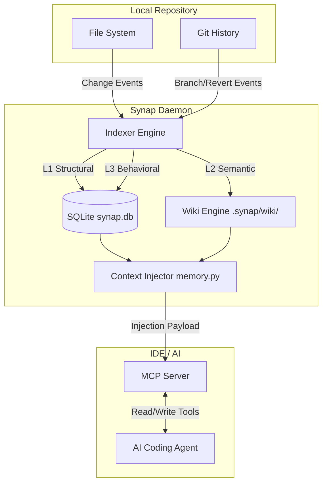
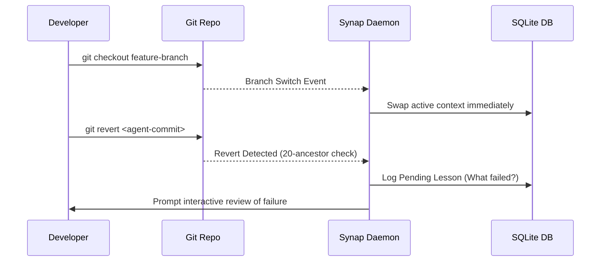
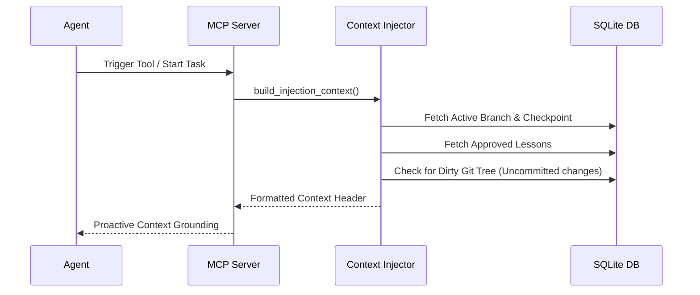

# Synap 🧠

<p align="center">
  <b>The Deterministic Context Injector for AI Coding Agents.</b>
</p>

<p align="center">
  <a href="https://github.com/saahilpal/synap-git/actions"></a>
  <a href="LICENSE.md"></a>
  <a href="SYNAP_BUILD_SPEC.md"></a>
</p>

---

Synap is **NOT a RAG system.** It is a strict, deterministic background daemon that mirrors your Git state and proactively pushes exact contextual boundaries to AI coding agents via the Model Context Protocol (MCP). Agents do not query Synap—Synap *injects* reality into Agents.

## 🏛️ Philosophy & Vision

1. **DETERMINISTIC FIRST:** If the agent sees it, it exists exactly as shown in the local filesystem.
2. **PUSH, NOT PULL:** Agents are terrible at querying for what they don't know exists. Synap bounds their context upfront.
3. **NOTHING HAPPENS SILENTLY:** Every action, decision, and LLM call is tracked, costed, and logged.
4. **LOCAL ONLY:** Your code never leaves your machine unless you explicitly configure a remote LLM. All state is kept in `.synap/synap.db`.
5. **MIRROR GIT EXACTLY:** Synap's state machine is perfectly synced to `HEAD`. If you switch branches, your agent's memory switches branches instantly.

---

## ⚡ Performance Architecture (v1.1.0)

Synap is built on the **Git-Snapshot Paradigm** to guarantee sub-100ms response times for everyday agent workflows:
- **Two separate code paths:** First-run indexing uses process-pool parallel parsing (`ProcessPoolExecutor`) to build the initial codebase structure, while subsequent indexing uses a Git delta change detector (`git diff-tree`) to process only changed files. (Reason: Avoids full filesystem scans on every run).
- **No filesystem scan / file hashing on incremental runs:** Synap uses Git blob OIDs to detect changed files. (Reason: Git already hashes everything, making filesystem reads redundant).
- **Decoupled non-deterministic LLM pipeline:** Structural parsing (deterministic, fast) completes immediately and enqueues wiki generation (non-deterministic, slow) to a background worker, while lazy caching fallback handles CLI/API wiki requests. (Reason: Never block structural indexing or CLI commands on LLM API response latency).
- **SQLite optimizations:** SQLite writes are grouped into a single transaction per batch (Reason: Avoids disk sync overhead per row). SQLite FTS5 index matches symbols in sub-milliseconds (Reason: Eliminates slow wildcard `LIKE` table scans). Pre-computed dot-separated `module_key` columns allow O(1) module resolution (Reason: Prevents suffix-matching scans).

---

## 🏗️ High-Level Architecture (HLD)

Synap bridges the gap between your local file system, Git history, and the LLM via a 3-layer indexing strategy.



---

## 🧩 The 3 Layers of Context

Synap provides three distinct layers of context to completely ground the agent:

### 1. L1: Structural (The Truth)
Deterministic mapping of code architecture using **Tree-sitter**.
- Fast, 100% accurate symbol extraction.
- Graph edges mapping `Imports`, `Inherits`, `Calls`, and `References`.
- Primary Key: `sha256(path + content_hash)` to completely eliminate edge-case collisions.

### 2. L2: Semantic (The "Why")
Hierarchical generated documentation stored locally as Markdown files (`.synap/wiki/`).
- **File Level:** What does this file do?
- **Module Level:** How do these files relate?
- **Project Level:** `overview.md` and `architecture.md`.

### 3. L3: Behavioral (Agent Memory)
Synap tracks the *history* of agent actions so the AI doesn't repeat past mistakes.
- **Checkpoints:** The active task the agent is performing (`synap checkpoint`).
- **Decisions:** Architecture decisions logged by the agent.
- **Lessons:** Generated automatically when a developer runs `git revert` on an agent's commit!

---

## 🔄 Low-Level Data Flows (LLD)

### Git Mirroring Flow
Synap's daemon watches the Git repository. The state of the repository completely drives the context.



### Context Injection Flow
When an Agent starts a task, it receives a strict, pre-packaged header injection.



---

## 🚀 Quick Start

### 1. Installation
Install the Synap CLI via `pip` or `uv`:
```bash
pip install synap-git
# or using uv:
uv tool install synap-git
```

### 2. Setup & Initialize
Interactive onboarding to set up your LLM providers (keys stored securely in your OS keyring).
```bash
synap setup .
```
Initialize the repo (Use `--skip-llm` to run in pure structural Mode A):
```bash
synap init .
```

### 3. Start the Daemon
Run the background watcher to keep Synap perfectly synced with Git:
```bash
synap start .
```

### 4. Connect to IDE
Start the MCP server to expose Synap to your AI Agent (Cursor, Windsurf, etc.):
```bash
synap mcp start .
```

---

## 💻 CLI Command Reference

Synap uses a powerful, strict CLI interface. Every destructive action prompts for approval.

### Core Lifecycle
- `synap init .` : Perform Pass 1 and Pass 2 indexing.
- `synap start .` : Launch the background polling daemon.
- `synap status .` : View active branch, indexed symbols, daemon state, and memory metrics.
- `synap rollback .` : Rollback active state to a previous commit.
- `synap recover .` : Recover from a corrupted database state.
- `synap run .` : Run all Synap services (Daemon, MCP, UI) concurrently.

### L3 Memory Management
- `synap memory status .` : View counts of approved, pending, and expired lessons.
- `synap memory prune .` : Prune expired rules and cleanup memory.
- `synap memory verify .` : Detect dangling file references in active memory.
- `synap lessons approve <id> .` : Approve a pending revert lesson to activate it.
- `synap lessons reject <id> .` : Reject and discard a pending lesson.
- `synap checkpoint create . --doing "..."` : Save the current context state.
- `synap checkpoint list .` : List all checkpoints for the active branch in a table.
- `synap checkpoint restore <id> .` : Show details of a checkpoint (or "latest").

### Developer Tools
- `synap wiki list .` : List all generated wiki documentation files.
- `synap wiki show <filepath> .` : Render a specific wiki markdown page to the console.
- `synap usage show .` : Display detailed aggregated LLM token usage.
- `synap usage clear .` : Purge all LLM call history.
- `synap doctor .` : Validate SQLite integrity, Tree-sitter, tokenizers, LLM providers, and daemon heartbeat.
- `synap mcp verify .` : Verify MCP protocol, tool schemas, and contract stability.

---

## 🤝 Contributing

Synap is built on the philosophy that AI tools must be transparent and controllable. If you're contributing:
- Do not introduce implicit RAG features.
- Adhere to the `SYNAP_BUILD_SPEC.md` strictly.
- Ensure all states are stored exclusively in `synap.db` or `.synap/wiki/`.

License: [Apache 2.0](LICENSE.md)
](LICENSE.md)
