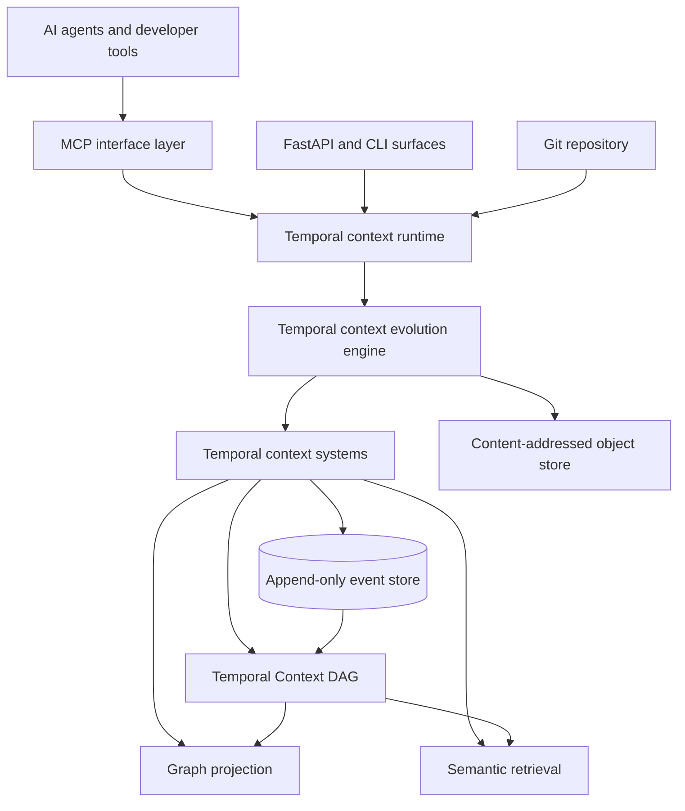

# Synapse

**Temporal source context management substrate and causal software evolution graph.**

Synapse is a local-first temporal context runtime that watches a repository, extracts durable architectural meaning from code, Markdown, Git history, and explicit human notes, then models how that understanding evolves through time.

Synapse is not a chatbot, a generic LLM wrapper, an autonomous-agent framework, or another static repository graph. It is a rollbackable context substrate for evolving software understanding.

## Why Synapse Exists

AI coding tools lose continuity when architecture evolves. They remember chat fragments, miss design intent, over-retain noise, and struggle with reverts, branches, rebases, and documentation drift. Synapse treats context as an engineered runtime concern instead of a prompt stuffing problem.

The goal is **causal context evolution**: keep the facts that matter, preserve where they came from, track when they were true, track the validation state, invalidate stale assumptions, and reconstruct what the substrate believed at any point in Git history.

## Core Architecture



## Design Principles

- Local-first by default; no cloud dependency is required for core operation.
- Git-native context; every durable context state is linked to repository history.
- MCP is the interface, not the brain.
- The Temporal Context Evolution Engine owns semantic diffs, timelines, assumption invalidation, validation state evolution, branch divergence, and temporal context replay.
- Event store and context objects are the source of truth; retrieval indexes are accelerators only.
- Meaning extraction beats raw retention.
- Context size is bounded through relevance scoring, compaction, validation states, and drift detection.
- Every durable fact has provenance, validation state, and validity semantics.
- Replays are deterministic and background processing is idempotent.

## Repository Layout

```text
src/synapse/              Python runtime package
docs/                     Architecture and engineering documentation
docs/adr/                 Architecture decision records
tests/                    Unit, integration, replay, and consistency tests
.github/workflows/        CI planning
.synapse.example/         Example local runtime directory layout
```

## Development Status

This repository now contains the first working local runtime foundation. It can:

- scan repository structure and Markdown;
- create immutable semantic annotations (context objects);
- link context commits to Git commits;
- maintain an append-only event log;
- replay and diff context states;
- activate previous context states without deleting history;
- generate semantic diffs and causal evolution timelines;
- track validation state evolution and assumption invalidation;
- journal context updates so event, object, and context writes can be recovered safely;
- verify context lineage with a `git fsck`-style checker;
- reconstruct replay traces, context lineage, and checkpoint-aware state hashes;
- run semantic impact, temporal query, incident anchoring, and hot/warm/cold tier foundations;
- expose read-only context through an MCP-facing facade.

The implementation is still pre-release. Vector retrieval, full Watchdog file streaming, external MCP SDK registration, and production temporal visualization are later phases.

## Quickstart For Contributors

Install `uv`, then run:

```bash
uv sync --all-extras --dev
uv run synapse init
uv run synapse status
uv run synapse timeline
uv run synapse diff <left-context> <right-context>
uv run synapse impact <left-context> <right-context>
uv run synapse lineage
uv run synapse --help
uv run pytest
```

Until `uv` is installed locally, the repository remains inspectable as standard Python source and Markdown documentation.

## Documentation Map

- [Vision](VISION.md)
- [Architecture Deep Dive](ARCHITECTURE.md)
- [Quickstart & Onboarding Guide](docs/quickstart.md)
- [Troubleshooting & Setup Guide](docs/troubleshooting.md)
- [Architecture: Runtime, API, & UI](docs/architecture/runtime.md)
- [Architecture: Semantic Annotations, Evolution, & Validation State](docs/architecture/cognition.md)
- [Architecture: Storage, Compaction, & Projections](docs/architecture/storage.md)
- [Architecture: Security Boundaries & Sanitization](docs/architecture/security.md)
- [Roadmap](ROADMAP.md)
- [Skills Matrix](SKILLS.md)
- [Contribution Guide](CONTRIBUTING.md)
- [Security Policy](SECURITY.md)
- [Architecture Decision Records](docs/adr/)
