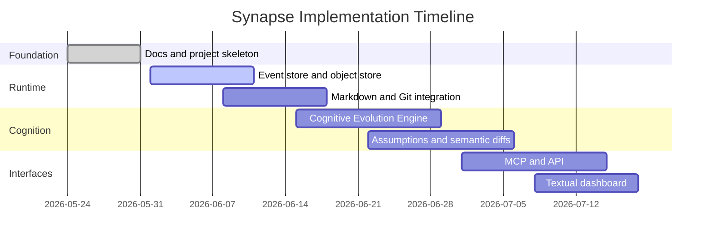

# Roadmap

The roadmap favors temporal context management over broad automation. Each phase must preserve local-first operation, deterministic replay, and bounded context growth.

## Phase 1: Foundation

- Repository structure and architecture documentation.
- Python project initialized with strict typing and test scaffolding.
- Local object store layout under `.synapse/`.
- Event schema and context object schema.
- CLI shell for `init`, `start`, `status`, `note`, `diff`, `rollback`, `doctor`.

## Phase 2: Core Runtime

- Async runtime daemon.
- Watchdog filesystem watcher.
- GitPython repository state reader.
- Append-only SQLite WAL event store.
- Content-addressed semantic annotations using msgpack.
- Markdown extraction engine using `markdown-it-py`.
- Initial Context DAG with replay.

## Phase 3: Temporal Context Evolution

- Cognitive Evolution Engine.
- Semantic Git diffs.
- Temporal Context DAG queries.
- Assumption Engine.
- Validation state evolution.
- Drift timelines.

## Phase 4: Causal Graph Projections

- Commit-linked context deltas.
- Rollback and checkout-aware context rewinds.
- Branch context inheritance.
- Causal merge conflict detection.
- Tree-sitter structural parsing.
- NetworkX graph projection.
- Qdrant semantic retrieval integration.
- Snapshot compaction.
- Context diff reporting.

## Phase 5: Interfaces

- MCP resources and tools.
- FastAPI REST API.
- WebSocket event stream.
- Textual dashboard.
- Permission-gated write tools.
- Agent-facing context search.

## Phase 6: Hardening

- Replay determinism tests.
- Rollback integrity tests.
- Cross-platform watcher tests.
- Performance profiling.
- Context poisoning protections.
- Migration planning for Neo4j-backed graph projection.

