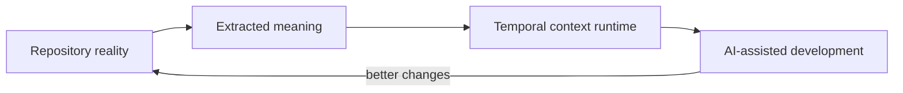

# Vision

Synapse is a **temporal source context management substrate and causal software evolution graph**: a local infrastructure that preserves a durable, versioned, replayable understanding of how a software project evolves.

The long-term ambition is not to make an all-purpose AI brain. Synapse exists as a small, reliable temporal source context substrate for engineering teams and AI agents: one that preserves repository structure, code intent, documentation, architectural decisions, assumptions, risks, and temporal change.

## Product Thesis

The most useful AI-assisted engineering systems will not be the ones that remember the most text or draw the richest static graph. They will be the ones that understand software through time: when assumptions became true, when architecture changed, when confidence decayed, and why the world model shifted.

Synapse exists to make that possible with local infrastructure developers can trust.

## What Synapse Optimizes For

- Cognitive efficiency over maximum intelligence.
- Temporal context evolution over static repository understanding.
- Causal software evolution over raw transcript storage.
- Bounded context over unbounded accumulation.
- Local control over remote dependency.
- Git-synchronized evolution over static project summaries.
- Provenance, validation state evolution, and semantic lineage over opaque recall.
- Explicit rollback over silent mutation.

## Non-Goals

- Synapse is not a model provider.
- Synapse is not a workflow automation bot.
- Synapse is not a replacement for Git.
- Synapse is not a static repository graph explorer.
- Synapse is not a vector database wrapper.
- Synapse is not a Kubernetes-scale distributed service.
- Synapse is not a reasoning layer hidden inside MCP.

## North Star

The system should feel like:

> Git + temporal source context substrate + causal evolution graph + developer runtime for evolving software understanding.
