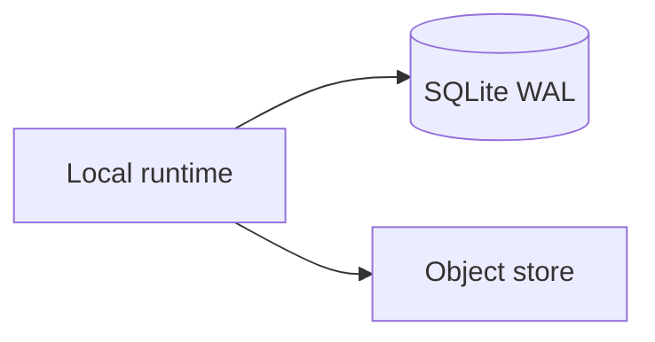

# ADR 0001: SQLite vs PostgreSQL

## Status

Accepted.

## Context

Synapse is a local daemon, not a cloud service. It needs durable metadata, transactional writes, easy setup, and replayable state without asking users to operate a database server.

## Decision

Use SQLite in WAL mode for the initial durable metadata store.

## Consequences

- Local-first setup stays simple.
- Transactions are strong enough for one repository daemon.
- WAL improves concurrent read behavior.
- Large payloads must stay in the object store, not SQLite rows.

## Alternatives Considered

- PostgreSQL: stronger for multi-user services, but operationally heavier and unnecessary for MVP.
- DuckDB: excellent analytics engine, but less appropriate as the primary transactional event store.

