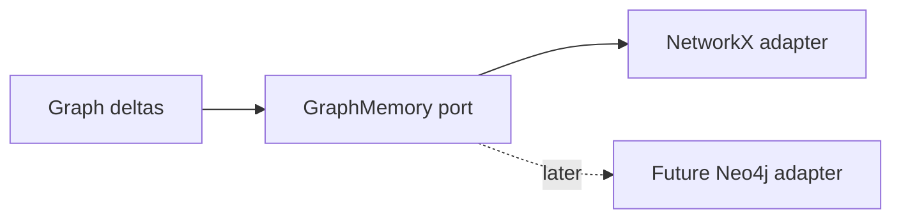

# ADR 0002: NetworkX First

## Status

Accepted.

## Context

Synapse needs a graph projection for entities, decisions, risks, dependencies, and temporal relations. A graph database may be useful later, but early design work needs fast local iteration and simple replay.

## Decision

Use NetworkX as the first graph projection backend, with an adapter boundary that can later support Neo4j.

## Consequences

- Graph semantics can evolve quickly in process.
- No external graph server is required.
- Graph size must be monitored because NetworkX is memory-bound.
- Adapter contracts must avoid leaking NetworkX types into cognition logic.

## Alternatives Considered

- Neo4j first: powerful but operationally expensive for a local-first MVP.
- Pure SQLite graph tables: durable but slower for exploratory graph algorithms.
