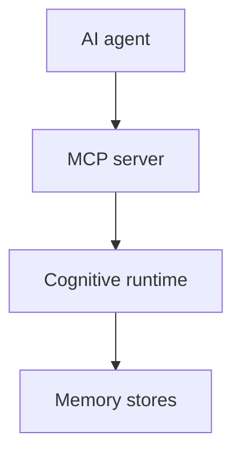

# ADR 0003: MCP As Interface Layer

## Status

Accepted.

## Context

MCP is becoming the standard way for AI applications to access tools and resources. Synapse should interoperate with MCP clients without making the protocol responsible for cognition.

## Decision

Treat MCP as an interface layer over the Cognitive Runtime. Runtime services own extraction, memory, trust, replay, and rollback semantics.

## Consequences

- Synapse remains model-agnostic.
- MCP tools stay thin and permission-gated.
- Runtime can also serve CLI, REST, WebSocket, and TUI interfaces.
- Security policy lives in Synapse, not in client prompts.

## Alternatives Considered

- Put reasoning inside MCP tools: rejected because it couples protocol and cognition.
- Avoid MCP: rejected because interoperability matters for agent tooling.

