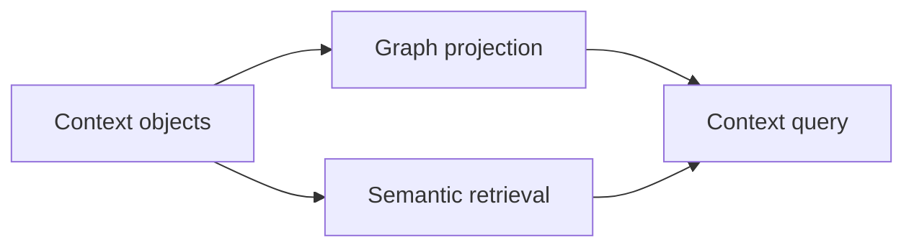

# ADR 0004: Hybrid Graph Projection And Semantic Retrieval

## Status

Accepted.

## Context

Vector-only retrieval is efficient for similarity but poor as a truth model. Graph-only projection captures structure but can be expensive and weak for fuzzy recall.

## Decision

Use graph projection for structural views and semantic retrieval for fuzzy lookup. Both are derived from context objects and events.

## Consequences

- Agents can retrieve semantically relevant facts and inspect structural relationships.
- Vectors never decide truth.
- Graph and vector indexes must carry provenance, confidence, validity, and context hash metadata.
- Derived indexes must be rebuildable.

## Alternatives Considered

- Vector-only retrieval: rejected due to stale and ungrounded retrieval risk.
- Graph-only projection: rejected because semantic recall would be weaker and slower to build.
