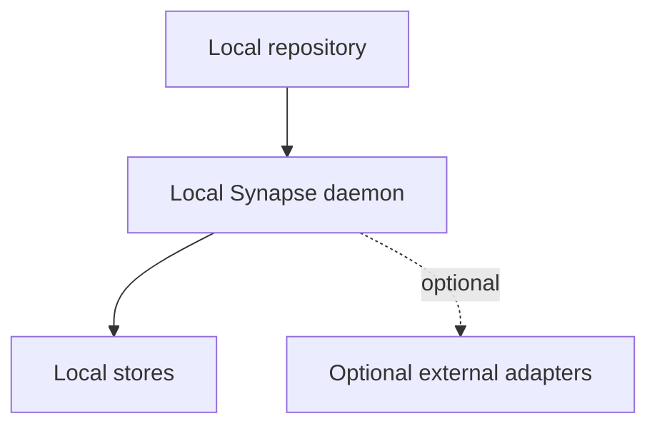

# ADR 0006: Local-First Architecture

## Status

Accepted.

## Context

Synapse handles sensitive repository context and should work without cloud services. Developers should be able to run it on a laptop with minimal setup.

## Decision

Make local-first operation a hard architectural constraint. External services and cloud models are optional adapters, not requirements.

## Consequences

- Core operation is private and portable.
- SQLite, filesystem object storage, NetworkX, and local Qdrant are favored early.
- Team synchronization is deferred until local trust semantics are stable.
- Optional cloud reasoning must never become a source-of-truth dependency.

## Alternatives Considered

- Cloud-first service: rejected due to privacy, operations, and trust concerns.
- Distributed runtime: rejected as overengineering for initial goals.

