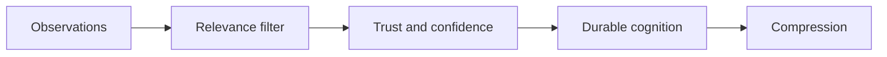

# ADR 0007: Bounded Cognition

## Status

Accepted.

## Context

Unbounded memory becomes noisy, expensive, slow, and unsafe. Synapse must optimize for cognitive efficiency instead of maximum retention.

## Decision

Adopt bounded cognition as a primary design rule. Relevance filtering, confidence, provenance, temporal validity, compression, and drift detection decide what remains active.

## Consequences

- Raw noise is not stored by default.
- Some low-signal facts may be missed and require manual correction.
- The runtime stays lightweight and explainable.
- Tests must cover filtering and invalidation behavior.

## Alternatives Considered

- Store everything: rejected because it creates memory bloat and trust problems.
- Store only manual notes: rejected because code and docs must update cognition automatically.

