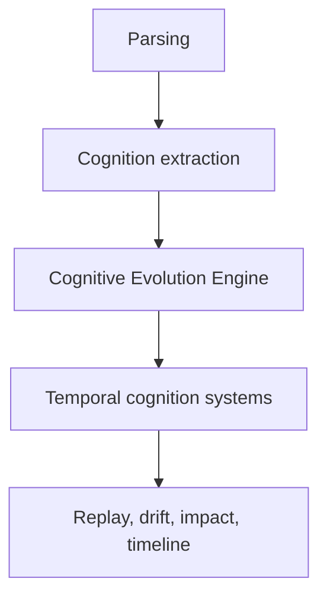

# ADR 0008: Temporal Cognition Over Static Understanding

## Status

Accepted.

## Context

Static repository understanding, graph extraction, onboarding, semantic exploration, and code visualization are valuable but increasingly crowded. Synapse's durable differentiation is time: evolving understanding, semantic lineage, rollbackable cognition, branch divergence, drift timelines, and architectural time travel.

## Decision

Position Synapse as temporal cognition infrastructure. The Cognitive Evolution Engine becomes the architectural center above extraction, DAG storage, replay, assumptions, confidence, and drift systems.

## Consequences

- Graph and semantic retrieval remain projections, not the product center.
- Public language should prefer cognition runtime, temporal cognition, semantic lineage, and context evolution over AI memory.
- New features should answer "how did understanding change?" before adding static exploration.
- Visualization should focus on timelines, replay, branch evolution, drift overlays, and confidence heatmaps.

## Alternatives Considered

- Compete as a static repository graph explorer: rejected because it overlaps too much with existing tools.
- Compete as AI memory storage: rejected because the category is saturated and less precise.

