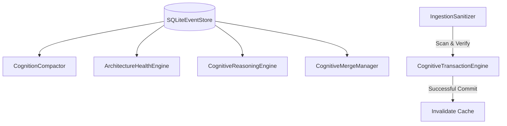

# ADR 0011: Production-Grade Features for Temporal Cognitive Operating System

## Context

To mature Synapse into a production-grade infrastructure platform, we must expand the codebase to support automated cognitive updates, time-based confidence evolution, architecture health assessments, branch merging, security checks, and database compaction.

## Proposed Architecture

We introduce the following core components:

### 1. Dynamic Confidence scoring
- **Time-based freshness decay**: Reduces trust ratings as a function of elapsed time.
- **Contradiction Penalty**: Penalizes confidence when opposing node claims exist.
- **Provenance Trust Propagation**: Low confidence in upstream dependencies cascades downstream.

### 2. Semantic Evolution Reasoning Engine
- **Coupling changes**: Compares afferent and efferent coupling of package/module nodes over successive context commits.
- **Semantic Drift**: Pinpoints code updates performed without accompanying decision or assumption changes.
- **Domain Erosion**: Detects high-confidence core modules depending directly on low-confidence dependencies.
- **Assumption Consequences**: Cascades invalidations downstream to trace all impacted files/modules.

### 3. Architecture Health Engine
- Computes afferent and efferent coupling, and subsystem instability: $I = C_e / (C_a + C_e)$.
- Computes system-wide Shannon change entropy across subsystems based on historical edit frequency.
- Combines stability, change frequency, and confidence scores into a subsystem health index clamped to `[0.0, 1.0]`.

### 4. Branch Cognition and Merging
- Locates the divergence point (common ancestor) of two branches in the context DAG.
- Detects modify/modify conflicts (differing summaries) and remove/modify conflicts.
- Identifies cross-branch assumption conflicts when one branch invalidates an assumption while another adds reference links to it.

### 5. Compaction and Archival
- **Deduplication**: Prunes duplicate adjacent historical semantic object entries in context runs.
- **Cold Ingestion**: Moves records older than 100 context commits from active tables to `cold_context_objects` and `cold_semantic_objects`.
- **Replay Checkpoints**: Stores Snapshots in the database to allow the ReplayEngine to skip oldest scans.

### 6. Ingestion Security
- **Prompt Injection Scanner**: Prevents malicious markdown inputs or system override injections from entering note ingestion.
- **HMAC Signatures**: Signs context hashes cryptographically using a secure signing key to prevent offline database tampering.

## Consequences

- Faster query times and lower disk space via compaction.
- Flawless, secure ingestion with prompt injection prevention and cryptographic signing.
- Visual, interactive feedback on confidence decay, system instability, and branch conflicts.
