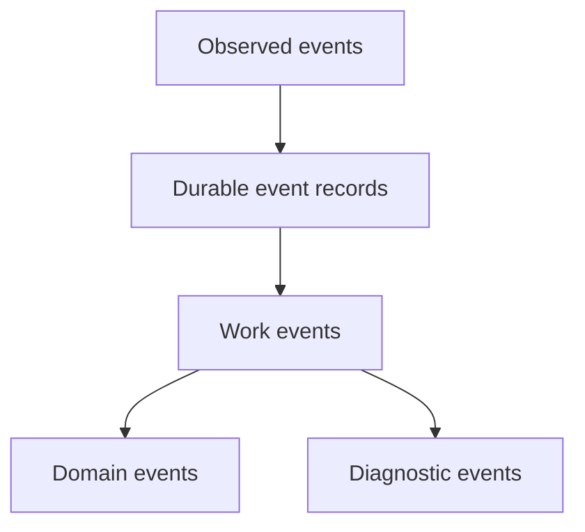

# Internal Events

## Purpose

Internal events define the runtime vocabulary for observed changes, semantic processing, projection updates, and diagnostics.

## Architecture

## Lifecycle

Events are normalized, versioned, validated, persisted when durable, and consumed by workers or interfaces.

## Responsibilities

- Define stable event names.
- Version event payload schemas.
- Preserve ordering metadata.
- Separate durable domain events from transient diagnostics.
- Support replay.

## Data Flow

Observed events can become durable event records. Work events schedule processing. Domain events update context and projections.

## Failure Modes

- Event names change without migration.
- Diagnostics become source-of-truth.
- Payloads contain unserializable data.
- Event ordering relies only on timestamps.

## Edge Cases

- Event with no semantic effect.
- Replayed event under newer code.
- Duplicate event ID.
- Event emitted by scheduled maintenance.

## Scalability Notes

Keep event payloads compact and place large details in object store.

## Security Notes

Events may carry sensitive paths and evidence references. Redact before exposing externally.

## Performance Considerations

Use msgpack for durable payload objects and lightweight references in SQLite rows.

## Future Extensibility

Add schema registry docs and compatibility tests as event families grow.

