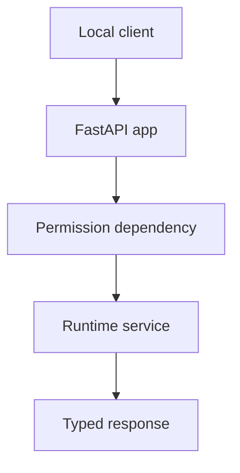

# REST API

## Purpose

The REST API gives local tools and dashboards a structured interface to Synapse runtime state without coupling them to internal services.

## Architecture

## Lifecycle

The API starts with the daemon, binds to loopback by default, exposes versioned endpoints, and delegates all behavior to runtime services.

## Responsibilities

- `GET /health`
- `GET /context/current`
- `GET /context/{hash}`
- `GET /context/{a}/diff/{b}`
- `GET /drift`
- `POST /notes`
- `POST /rollback`
- `GET /graph/summary`

## Data Flow

Requests become typed command/query objects. Responses include context hash, freshness, confidence, and provenance where relevant.

## Failure Modes

- API mutates state outside event pipeline.
- Endpoint returns stale projection without marker.
- No versioning for response schemas.
- Sensitive context is returned unredacted.

## Edge Cases

- Runtime is indexing.
- Requested context is archived.
- Rollback target missing.
- Client requests branch-specific context.

## Scalability Notes

REST is local-first and not a public multi-tenant API. Pagination and limits still apply.

## Security Notes

Bind to `127.0.0.1` by default and require explicit configuration for network exposure.

## Performance Considerations

Read endpoints should use projection caches by context head. Mutating endpoints enqueue events.

## Future Extensibility

Add OpenAPI examples and generated client bindings after schemas stabilize.

