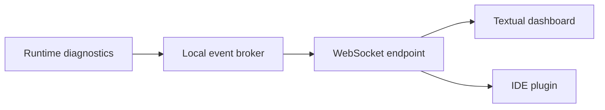

# WebSocket Events

## Purpose

WebSocket events stream runtime status, indexing progress, drift warnings, and context updates to local dashboards and developer tools.

## Architecture

## Lifecycle

Clients subscribe to event categories. The runtime publishes bounded status messages with sequence IDs and context hashes.

## Responsibilities

- Stream queue status.
- Stream worker progress.
- Notify context head changes.
- Notify drift findings.
- Notify permission denials and repair needs.

## Data Flow

Diagnostic events flow from runtime components to the local broker, then to connected clients.

## Failure Modes

- Event stream leaks sensitive content.
- Slow client causes unbounded buffers.
- Client misses critical state transition.
- WebSocket event shape drifts from REST schemas.

## Edge Cases

- Client reconnects after daemon restart.
- Runtime replays history.
- Multiple dashboards subscribe.
- Low-power mode defers work.

## Scalability Notes

Use bounded per-client buffers and send summaries instead of raw payloads.

## Security Notes

Apply the same permissions as REST resources. Do not stream raw evidence by default.

## Performance Considerations

Coalesce high-frequency progress updates and include latest sequence IDs for resync.

## Future Extensibility

Add MCP resource-change notifications when client support matures.

