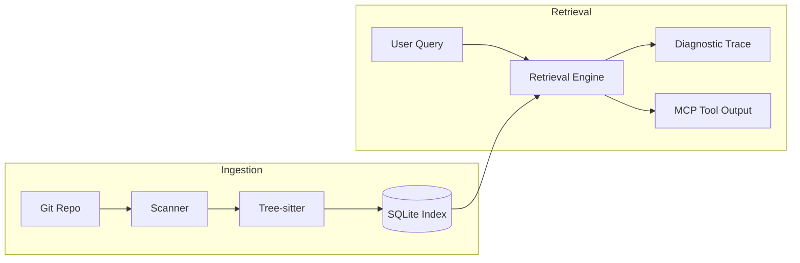

# Synap Architecture

Synap is built as a deterministic indexing engine and retrieval runtime. It is designed to be the "infrastructure of record" for AI coding agents, providing a stable, verifiable substrate of repository knowledge.

## Core Philosophies

1.  **Deterministic Projection:** The system state is a pure function of the Git repository state and the parsing rules. There is no independent internal evolution of "truth."
2.  **Parser-First Grounding:** Retrieval is only as good as the underlying symbols. We use **Tree-sitter** to ensure absolute structural accuracy.
3.  **SQL-Centric Storage:** We leverage SQLite's WAL mode and Recursive CTEs for high-performance, low-latency graph traversals without the overhead of a dedicated graph database.

## System Components

### 1. Git Source of Truth
Synap monitors the Git working tree. Every index operation begins by resolving the current `HEAD` and identifying changed files via content hashes.

### 2. Tree-sitter Parser Registry
Files are parsed into Concrete Syntax Trees (CST) using Tree-sitter. We currently support:
- **Python**
- **JavaScript / JSX**
- **TypeScript / TSX**

The parser extracts symbols (classes, functions, etc.) and relationships (imports, call edges).

### 3. SQLite Storage Engine
Storage is divided into:
- **Files:** Path, Git OID, and content hash.
- **Symbols:** Deterministic IDs based on path and name.
- **Edges:** Structural relationships (e.g., `depends_on`).
- **Embeddings:** Content-addressed vector cache.
- **Retrieval Traces:** Diagnostic logs of retrieval operations.

### 4. Hybrid Retrieval Engine
Retrieval follows a strict 4-stage pipeline:
1.  **Temporal:** Filter by active branch and recent commits.
2.  **Structural:** Expand search from keywords to neighbors using SQL CTEs.
3.  **Lexical:** Match exact identifiers and keywords.
4.  **Semantic:** conceptually related matches (fallback).

### 5. Model Context Protocol (MCP)
Synap exposes its capabilities via the standard MCP. This allows any MCP-compatible agent (Cursor, Claude, Roo) to consume grounded context via standard tools.

---

## Symbol Extraction Pipeline

The extraction process transforms raw text into high-fidelity structural data.

## High-Level Flow

