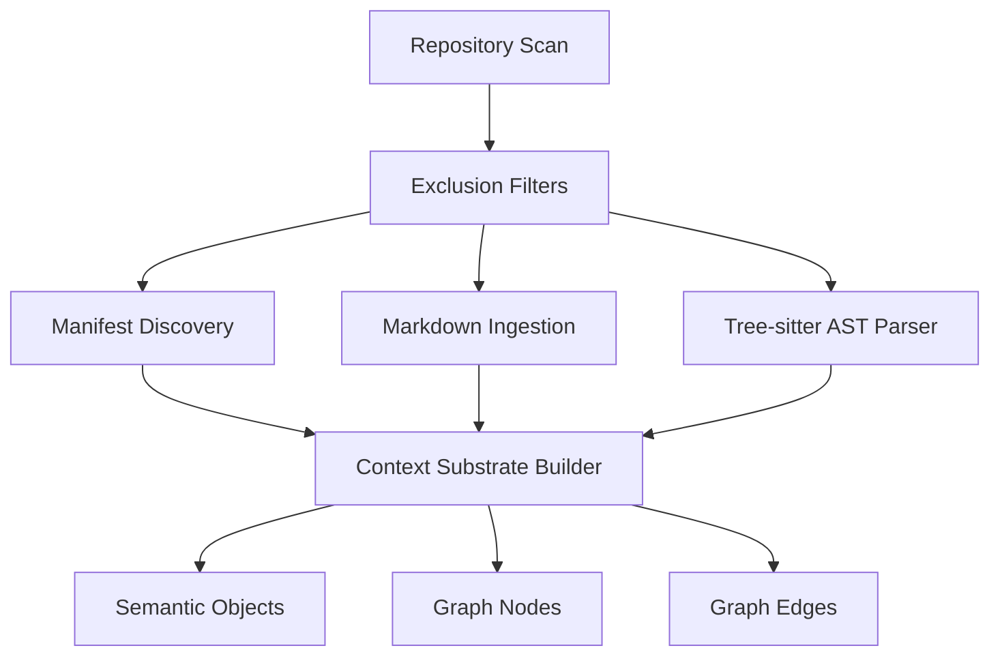
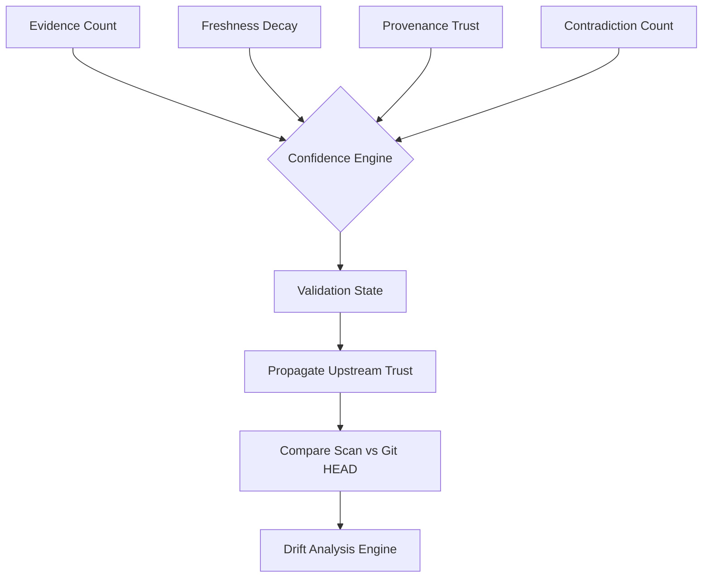
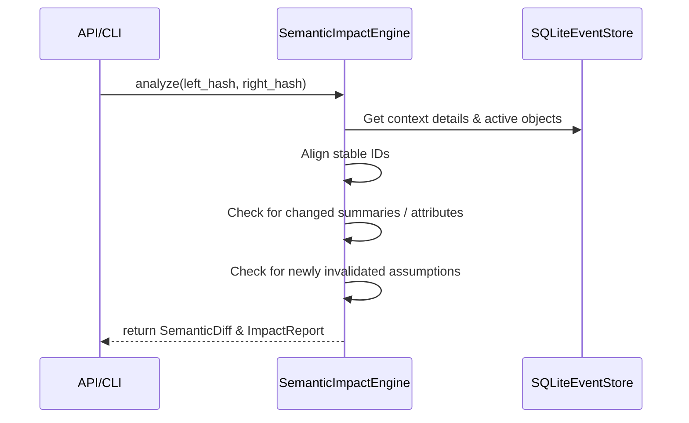
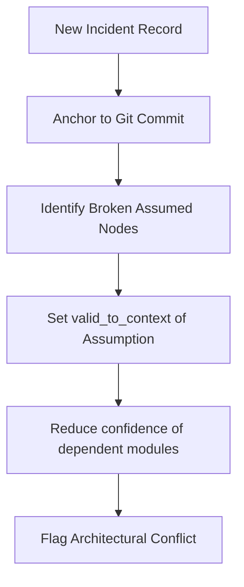
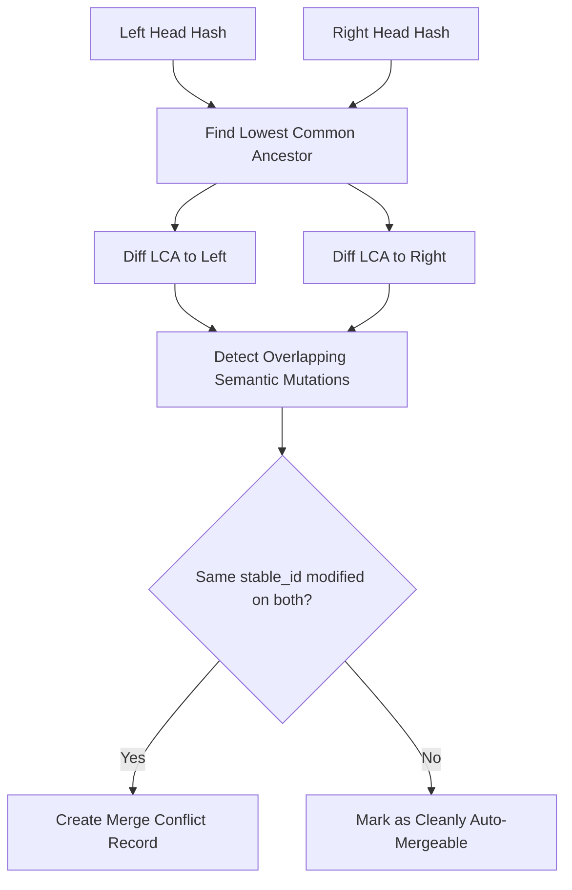

# Semantic Annotations, Evolution, & Validation State

This document outlines the temporal structures of Synapse, explaining how semantic annotations are extracted, how validation states are calculated, and how branch context merges are resolved.

---

## 1. Subsystem Architecture

### Ingestion & Structure Ingestion Pipeline
Extracts semantic observations from repository source files and Markdown documentation.

- **WHY**: Raw source text is too noisy for LLM context limits. We need a parser that extracts structured semantic nodes (definitions, decisions, assumptions) to create a bounded model.
- **HOW**: Markdown is parsed into headings and blocks, while code structure is parsed using tree-sitter AST nodes. These are transformed into content-addressed `SemanticObject` and graph representations.
- **TRADEOFFS**: Fine-grained AST parsing can be slower on massive source trees; addressed by scanning only modified files.

---

### Validation State & Drift Engine
Tracks fact validity, freshness decay, contradictions, and workspace divergence.

- **WHY**: Context deteriorates as code changes. If documentation asserts behavior that is no longer supported by code, drift accumulates and confidence should decay.
- **HOW**: `ConfidenceEngine` runs freshness decay based on a mathematical half-life. Contradictory facts apply penalty coefficients. `DriftDetector` computes git-diff lines to flag out-of-sync documents.
- **TRADEOFFS**: Constant decay calculations add complexity. The engine computes them on demand during queries or compaction checkpoints.

---

## 2. Pipeline & Workflow Diagrams

### Context Evolution & Semantic Diff
Analyzes modifications, additions, and invalidations between two context hashes.

- **WHY**: Developers need to see how the system's architecture model evolved across branches or commits.
- **HOW**: The diff engine queries the reconstructed fact graphs at both context hashes and compares them key-by-key, cataloging additions, removals, and replacements.

---

### Assumption Invalidation Cascade
When code changes or incidents are logged, connected assumptions are invalidated.

- **WHY**: When a production incident occurs due to database session loss, the assumption "Database is always online" is proven invalid.
- **HOW**: The incident anchoring maps the time/commit of the incident, finds linked assumptions, and sets their validity intervals, immediately downgrading dependent modules' trust scores.

---

### Branch Context Merge Flow
Detects causal merge conflicts between diverging branches.

- **WHY**: Like git conflicts, contextual understanding can diverge on different development branches (e.g. branch A assumes sqlite, branch B assumes postgres).
- **HOW**: Traverses parent edges in the context DAG to find the lowest common ancestor, compares left and right deltas, and identifies overlapping mutations.
