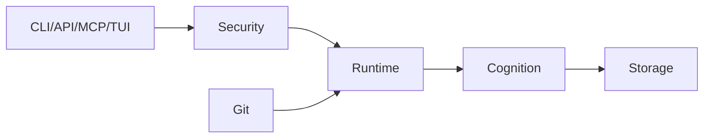

# Module Specs

## Purpose

Module specs define the responsibilities, inputs, outputs, and ownership boundaries for the first implementation.

## Architecture

## Lifecycle

Each module exposes a small public contract, receives tests at that boundary, and hides adapter details internally.

## Responsibilities

- Runtime owns process, queue, worker, scheduler, replay, and shutdown behavior.
- Cognition owns semantic object creation, relevance, confidence, drift, compression, and DAG semantics.
- Storage owns transactions, object IO, graph/vector projections, and migrations.
- Git owns repository state observation and Git-to-context mapping.
- Interfaces own validation, permissions, serialization, and user-facing responses.
- Security owns trust, permission, redaction, and sandbox policy.

## Data Flow

Git and file events enter runtime, cognition emits deltas, storage persists truth and projections, and interfaces read scoped views.

## Failure Modes

- Module reaches across boundaries for convenience.
- Storage adapter returns backend-specific objects to cognition.
- Security checks are duplicated inconsistently.

## Edge Cases

- Runtime starts without optional MCP package.
- Storage rebuild runs while API reads.
- Git repository is absent during project bootstrap.

## Scalability Notes

Contracts should permit backend replacement without changing domain semantics.

## Security Notes

Security policy must be central and called by all interfaces.

## Performance Considerations

Keep hot module APIs allocation-conscious and avoid importing optional heavy dependencies at module import time.

## Future Extensibility

Introduce explicit plugin ports for extractors, embedders, graph backends, and model providers.

