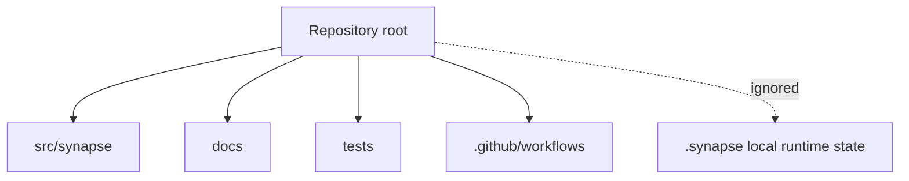

# Repository Structure

## Purpose

This document defines how the Synapse repository is organized so modules can grow without collapsing into a single runtime blob.

## Architecture

## Lifecycle

New subsystems begin with docs, contracts, and tests. Runtime state belongs under `.synapse/` and is ignored by Git.

## Responsibilities

- `src/synapse/runtime`: daemon, queues, workers, replay.
- `src/synapse/cognition`: domain objects, extraction, relevance, confidence, DAG.
- `src/synapse/replay`: deterministic replay diagnostics and lineage reconstruction.
- `src/synapse/transactions`: journaled cognitive transaction boundaries.
- `src/synapse/lineage`: cognition DAG integrity verification.
- `src/synapse/query`: temporal cognition query services.
- `src/synapse/impact`: semantic impact analysis for cognitive Git diffs.
- `src/synapse/storage`: SQLite, object store, graph, vector adapters.
- `src/synapse/git`: Git synchronization and branch semantics.
- `src/synapse/mcp`: MCP tools and resources.
- `src/synapse/api`: FastAPI and WebSocket surfaces.
- `src/synapse/observability`: logs, metrics, diagnostics.

## Data Flow

Interfaces call runtime services; runtime services use cognition models and storage ports; adapters perform IO.

## Failure Modes

- Cyclic imports between runtime and adapters.
- Interface modules owning domain behavior.
- Tests depending on local `.synapse` state.

## Edge Cases

- Optional integrations such as MCP and Qdrant may not be installed.
- Language-specific parser modules may grow under cognition.
- Future plugins should not mutate core package layout.

## Scalability Notes

Package boundaries should scale by bounded context, not by technology layer alone.

## Security Notes

Keep local state ignored by Git and avoid committing generated cognition objects.

## Performance Considerations

Import paths used by CLI help should remain lightweight and not initialize heavy adapters.

## Future Extensibility

Add plugin discovery under `src/synapse/plugins` only after core ports are stable.
