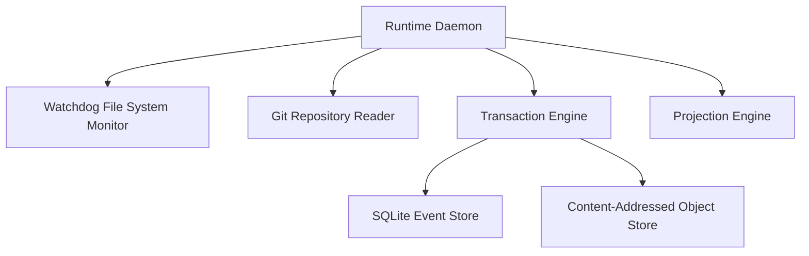
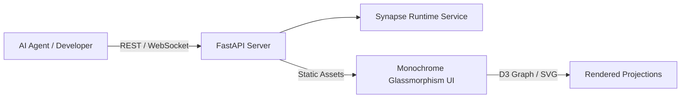
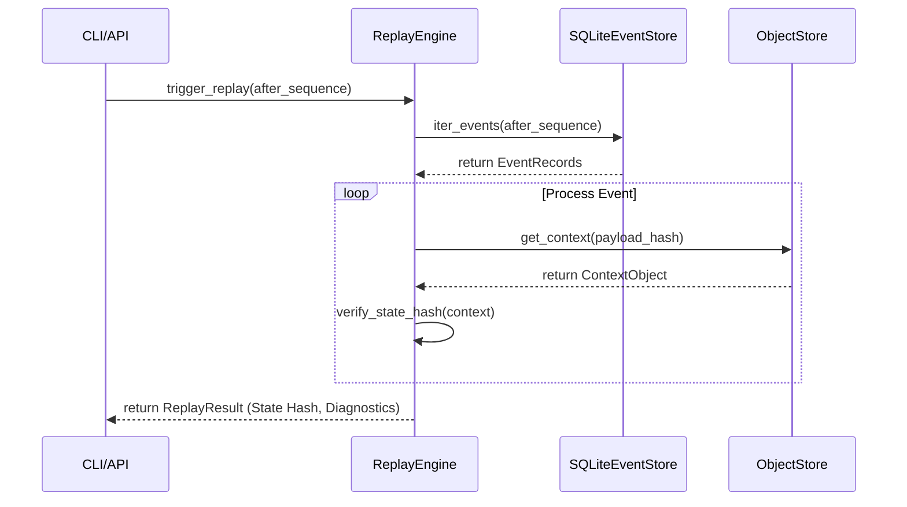
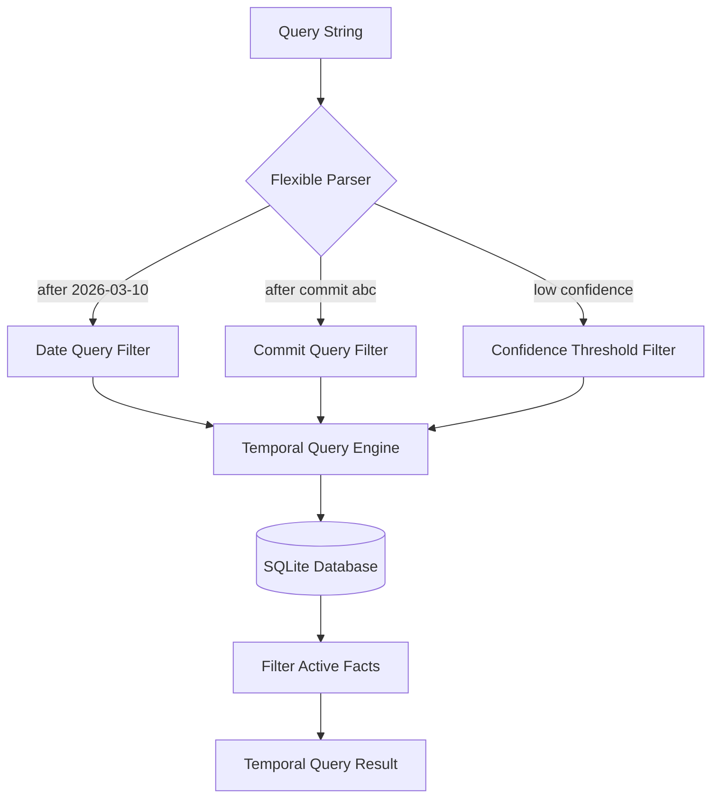
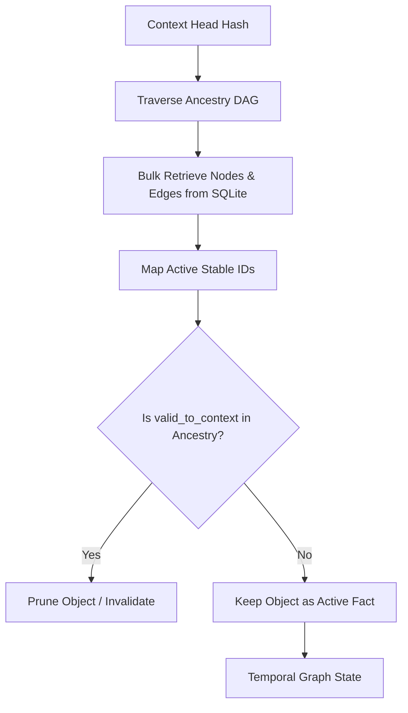

# Runtime, API, & UI Architecture

This document describes the core execution layer of Synapse, covering the runtime lifecycle, the FastAPI visualizer API, the monochrome glassmorphism UI, and key temporal reconstruction pipelines.

---

## 1. Subsystem Architecture

### Runtime Architecture
The Synapse runtime coordinates the local event sourcing system, the filesystem watchers, Git tracking, and the evolution engines.

- **WHY**: A daemon-driven architecture ensures that filesystem modifications and Git commit state transitions are captured in real-time, matching context state directly with workspace snapshots.
- **HOW**: The daemon initializes file monitors (Watchdog) and repository connections (GitPython) in separate task loops, feeding changes through the `TransactionEngine` to commit events.
- **TRADEOFFS**: Running a local background daemon consumes low but constant memory. If the repository is massive, scanning can cause initial CPU spikes (throttled by config file limits).
- **FAILURE MODES**: If the daemon crashes, events are not captured in real-time. Upon restart, Synapse traverses the Git history to reconcile any missed commits, recovering gracefully.

---

### UI & API Architecture
Exposes local context structures to developers and agents via REST API, WebSockets, and a monochrome web explorer.

- **WHY**: Visualizing multi-dimensional temporal graphs and lineage branches requires a clean, fast web dashboard. A decoupled REST/WebSocket API allows agents (MCP) and visualizers to query the same state.
- **HOW**: FastAPI serves static files (HTML/CSS/JS) and API endpoints. The frontend uses D3.js with custom monochrome variables for performance-tuned visual rendering.
- **TRADEOFFS**: Direct HTTP query polling can add overhead on huge graphs; resolved by caching compiled projections within SQLite.
- **FAILURE MODES**: API abuse (e.g. infinite loop requests) or path traversal is blocked by strict limits clamping query size, depth, and path resolution.

---

## 2. Pipeline & Workflow Diagrams

### Temporal Replay Workflow
Replays raw transaction events from a given event sequence to reconstruct the exact state of the context DAG.

- **WHY**: Replayability is the foundation of temporal context determinism. We must guarantee that replaying the event log yields the exact same context state hash.
- **HOW**: The `ReplayEngine` loops through transaction logs sequentially, loading context objects, recalculating hashes, and comparing them against stored records to identify state divergence.
- **FAILURE MODES**: If a local context object is manually edited or corrupted on disk, the state hash verification fails, yielding a diagnostic report marking the corrupted context hash.

---

### Temporal Query Flow
Resolves flexible queries (dates, commits, incidents, drift, confidence boundaries) to compile facts.

- **WHY**: Developers need to query what the system believed at a specific date, commit, or during a specific production incident.
- **HOW**: `TemporalQueryEngine` parses natural string modifiers, resolves branches/git hashes to their active context heads, and executes range scans against the database.
- **FAILURE MODES**: Querying before the initial commit returns an empty result set.

---

### Graph Reconstruction Flow
Reconstructs active nodes and edges valid at a specific context head.

- **WHY**: Context ancestry can have hundreds of commits. Traversing them one-by-one is slow ($O(N)$ query pattern).
- **HOW**: Synapse bulk retrieves all graph objects associated with the context list and traverses backward, overriding modified states and prunings to reconstruct the active topological view.
- **TRADEOFFS**: Bulk loading consumes memory; solved by bounding ancestry traversal depth to a configured limit.
