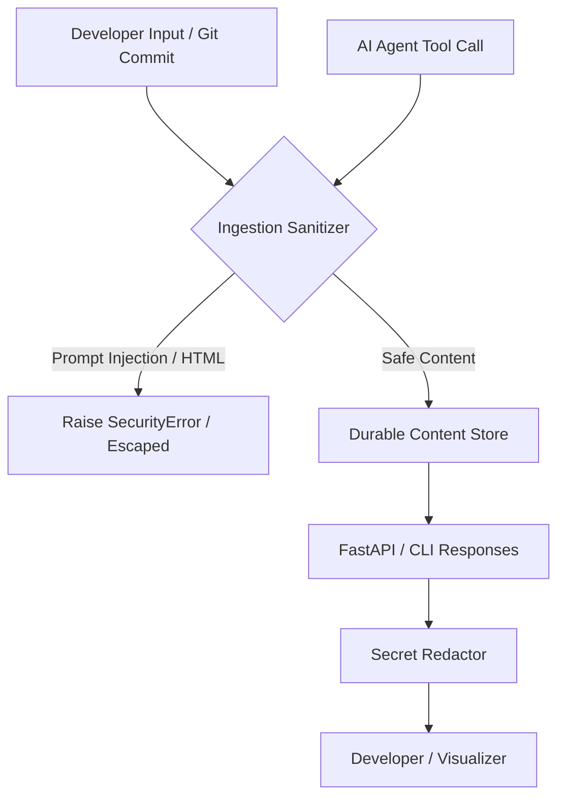
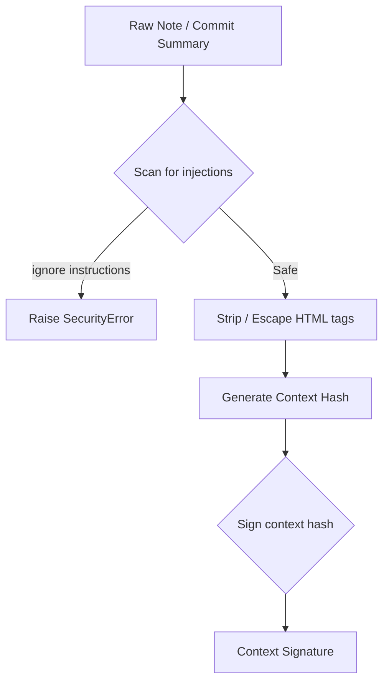

# Security Boundaries & Sanitization

This document describes the Synapse security design, detailing data boundaries, prompt injection mitigation, HTML sanitization, and cryptographic signing.

---

## 1. Subsystem Architecture

### Security Boundaries
Synapse acts as a local-first service but enforces strict security boundaries to prevent malicious ingestion and exfiltration of sensitive repository data.

- **WHY**: AI-agent outputs or untrusted repositories can contain prompt injections, HTML payloads, or exposed credentials.
- **HOW**: Ingestion goes through the `IngestionSanitizer`. Responses leaving the service pass through the `SecretRedactor` to remove passwords, API keys, database credentials, and GitHub tokens.
- **TRADEOFFS**: Constant scanning of response outputs adds a small serialization overhead; mitigated by highly optimized regex matches.

---

## 2. Pipeline & Workflow Diagrams

### Security Sanitization Pipeline
Details how inputs and outputs are validated, signed, and sanitized.

- **WHY**: A compromised repository file should not be able to execute scripts inside the local visualizer UI or hijack the runtime.
- **HOW**: `SafeMarkdownRenderer` parses markdown structure and escapes scripts or mailto/unsafe URL schemes. `IngestionSanitizer` signs the resulting context hash with a local HMAC-SHA256 key to verify lineage integrity.
- **FAILURE MODES**: If a context signature does not match, the lineage verifier flags it as tampered state.
