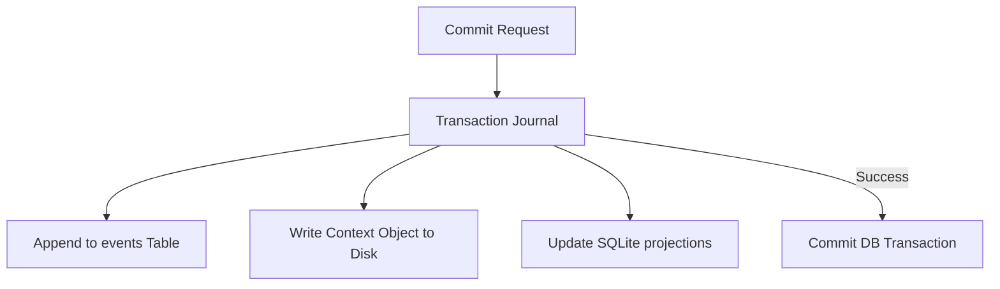
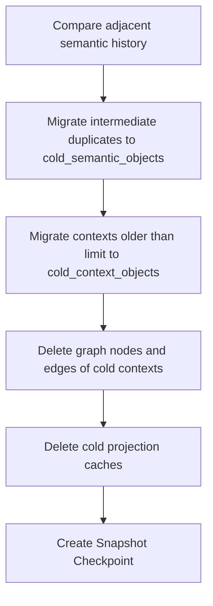
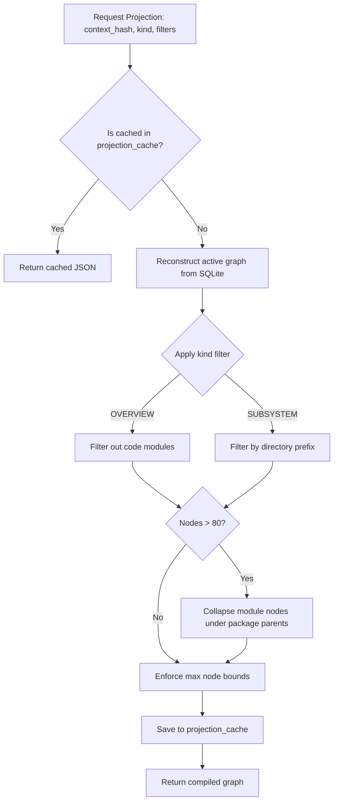

# Storage, Compaction, & Projections

This document outlines the Synapse storage model, including transaction journaling, compaction workflows, event-sourcing persistence, and graph projection generation.

---

## 1. Subsystem Architecture

### Event Sourcing & Storage Engine
Uses an append-only event stream in SQLite combined with a local content-addressed msgpack object store.

- **WHY**: Local architectural intelligence must be durable, audit-safe, and rollbackable. An append-only log guarantees that context history cannot be silently overwritten or tampered with.
- **HOW**: `SQLiteEventStore` stores events, context lists, active heads, and indexing targets. The transaction engine wraps writes in database transactions, rollbacking all states upon write failure.
- **TRADEOFFS**: Writing both context logs and object stores increases disk I/O; mitigated by using SQLite WAL mode and bulk inserts.

---

### Compaction & Checkpoint Flow
Compresses context history by deduplicating adjacent identical changes and migrating historical states to cold storage.

- **WHY**: As development progresses, thousands of commits accumulate. Storing every intermediate graph state in active memory tables causes database bloat.
- **HOW**: `CognitionCompactor` deduplicates adjacent events with identical values, deletes redundant intermediate objects, moves historical records to cold tables, and creates a snapshot checkpoint.
- **TRADEOFFS**: Queries on cold storage contexts require reading from cold tables, adding minor query latency (which is acceptable for historical lookups).

---

## 2. Pipeline & Workflow Diagrams

### Projection Generation Flow
Generates, filters, caches, and clusters graph projections for visualization.

- **WHY**: Visualizing hundreds of code modules in D3.js creates visual clutter and slows rendering.
- **HOW**: `ProjectionEngine` filters nodes based on kind. If the node count exceeds 80, it dynamically collapses module nodes into their parent package nodes, routing connected edges accordingly.
- **FAILURE MODES**: If the cache gets out of sync, the API allows passing `bypass_cache=True` to compile the graph from scratch.
