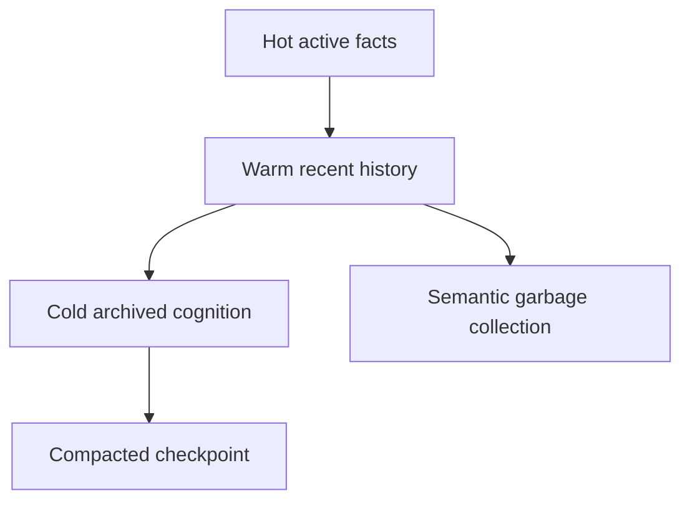

# Compression

## Purpose

Compression keeps cognition bounded by deduplicating, summarizing, expiring, and archiving low-value historical detail while preserving replayable truth.

## Architecture

## Lifecycle

Compression runs during idle windows or explicit maintenance. It never edits event history; it creates compacted objects, snapshots, and inactive references.

## Implemented Contract

`src/synapse/cognition/tiers.py` defines the first hot/warm/cold cognition tier policy. Active recent facts remain hot, recent historical facts become warm, and low-confidence or old facts become cold. This is a policy foundation for future compaction and semantic compression; it does not rewrite event history.

## Responsibilities

- Deduplicate equivalent semantic objects.
- Archive inactive facts.
- Summarize long histories.
- Compact snapshots.
- Preserve audit and replay semantics.

## Data Flow

Active facts remain queryable. Older facts move into cold storage with summary links and provenance references.

## Failure Modes

- Compression destroys evidence.
- Snapshots become treated as truth.
- Archived facts disappear from historical queries.
- Summaries lose branch-specific nuance.

## Edge Cases

- A rollback reactivates cold facts.
- A long-lived branch needs old assumptions.
- A compressed object contains sensitive content.
- Duplicate facts have different provenance.

## Scalability Notes

Use content-addressed chunks and reference counts. Compression should reduce derived index size without rewriting primary events.

## Security Notes

Archived and compressed objects retain their original access controls.

## Performance Considerations

Run compression with backpressure and cancellation support. Avoid competing with active indexing.

## Future Extensibility

Introduce configurable retention classes for personal, team, and regulated repositories.
