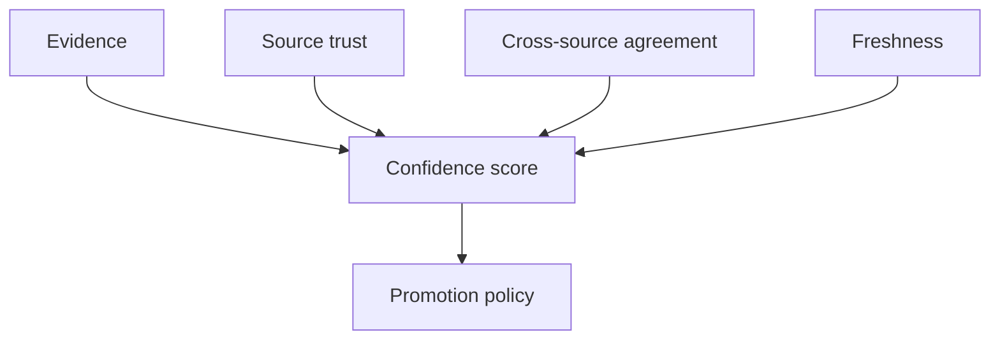

# Confidence Engine

## Purpose

The confidence engine assigns and updates belief strength for facts, relations, and summaries. It prevents low-evidence guesses from becoming durable truth.

## Architecture



## Lifecycle

Candidate facts start with provisional confidence. Scores change when new evidence appears, drift is detected, manual corrections arrive, or source trust changes.

## Implemented Contract

`src/synapse/confidence/` provides a deterministic first confidence model:

```text
confidence = evidence_weight * freshness_weight * provenance_weight * (1 - contradiction_penalty)
```

Evidence weight saturates as evidence count grows, provenance trust is explicit, freshness is supplied by temporal callers, and contradiction penalties reduce confidence without deleting historical evidence.

## Responsibilities

- Score facts between 0 and 1.
- Track rationale and evidence count.
- Gate promotion into active context.
- Downgrade stale or contradicted facts.
- Expose low-confidence warnings to agents.

## Data Flow

Extractor output enters confidence scoring before persistence. Active context queries include confidence filters and rationale references.

## Failure Modes

- Confidence becomes a decorative number.
- Scores rise without independent evidence.
- High-confidence wrong facts remain sticky.
- Human corrections are underweighted.

## Edge Cases

- One authoritative doc beats many weak inferred signals.
- A branch intentionally lowers confidence on mainline assumptions.
- A fact is true but has sparse evidence.
- Model-assisted extraction produces plausible but unsupported claims.

## Scalability Notes

Confidence updates should target affected facts rather than re-score the whole graph.

## Security Notes

Untrusted sources should not boost confidence without verification. Agent output starts low-trust unless explicitly approved.

## Performance Considerations

Use cheap heuristics first and reserve model-assisted validation for high-impact facts.

## Future Extensibility

Add pluggable confidence policies for teams with different review tolerance.
