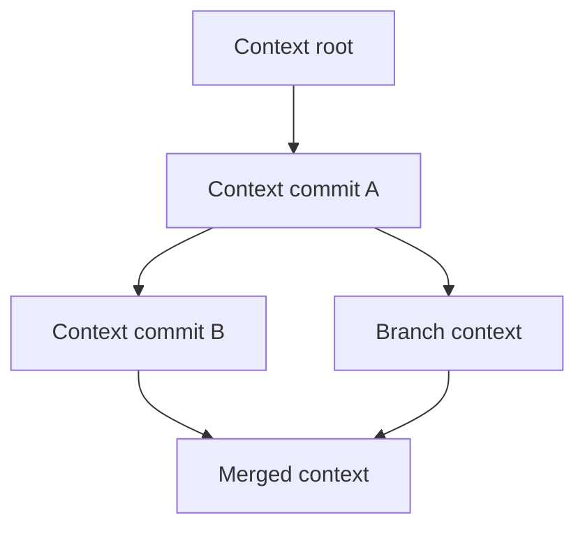

# Context DAG

## Purpose

The Context DAG is the version graph of Synapse cognition. It records how the project world model changes over time and links every durable context state to Git history.

## Architecture

## Lifecycle

A context node is created after relevant events are processed into semantic and graph deltas. Nodes are immutable. Rollback activates an earlier node; merge creates a new node with multiple parents.

## Responsibilities

- Preserve cognition lineage.
- Link context states to Git commits and branches.
- Support diff, replay, rollback, and merge.
- Separate active state from historical state.
- Keep derived graph/vector indexes reconstructable.

## Data Flow

Events produce deltas, deltas produce `ContextObject` records, and context objects become DAG nodes. Active memory views are projections from the selected DAG head.

## Failure Modes

- Parent references missing from object store.
- Two workers create conflicting heads.
- Rebase leaves context nodes linked to unreachable Git commits.
- Snapshot state hash does not match DAG head.

## Edge Cases

- Merge commits with no semantic conflict.
- Branches that intentionally contradict mainline decisions.
- Detached HEAD work.
- Reverts that semantically undo but do not delete prior history.

## Scalability Notes

Store deltas, not full world states. Periodic checkpoints accelerate replay while preserving the event/object source of truth.

## Security Notes

DAG activation must require permission when invoked through remote-facing tools. Historical context may contain sensitive facts and should be access-controlled like current context.

## Performance Considerations

Keep node lookup indexed by context hash, Git commit hash, branch name, and creation time. Use snapshots for long DAG replay.

## Future Extensibility

Future multi-repository cognition can model cross-repo edges as DAG references without merging repositories into one state blob.

