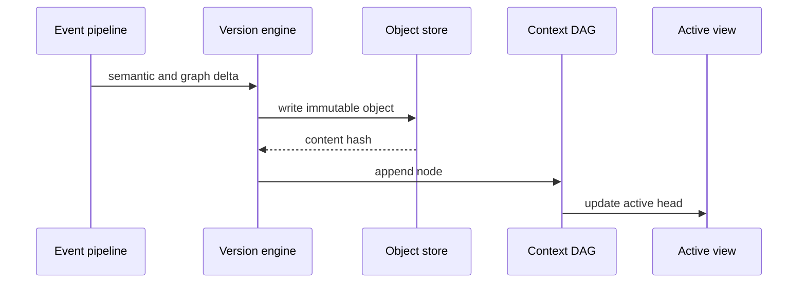

# Context Versioning

## Purpose

Context versioning defines how Synapse creates, names, activates, compares, and rolls back cognition states.

## Architecture

## Lifecycle

Each context version is created atomically from one or more processed events. Activation is a separate operation from creation so rollback and branch views can switch heads without mutation.

## Responsibilities

- Compute stable object hashes.
- Enforce parent references.
- Link to Git commit and branch metadata.
- Generate context diffs.
- Support historical activation.

## Data Flow

Processed deltas become content-addressed objects, then DAG nodes, then active graph/vector projections.

## Failure Modes

- Non-deterministic serialization changes object hashes.
- Active head changes before derived indexes update.
- Context diff ignores expired facts.
- Rollback deletes history instead of changing active head.

## Edge Cases

- Multiple events coalesce into one context version.
- A context version has no Git commit because it came from a note.
- A Git commit has no meaningful cognition delta.
- Merge creates a multi-parent context version.

## Scalability Notes

Version lookups should be cheap by context hash, Git commit, and branch. Diffs should use stored deltas before falling back to replay.

## Security Notes

Activation and rollback through MCP require write permission. Read-only clients may inspect allowed historical versions.

## Performance Considerations

Use msgpack with canonical field ordering for hash stability and compact storage.

## Future Extensibility

Support signed context versions and team-shared context remotes after local semantics are stable.

