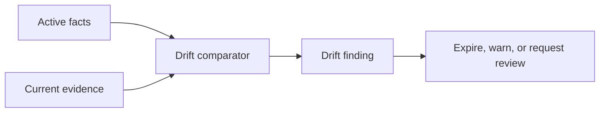

# Drift Detection

## Purpose

Drift detection identifies when stored cognition no longer matches repository reality. It protects agents from stale assumptions.

## Architecture

## Lifecycle

Drift scans run after relevant file changes, Git events, scheduled maintenance, and manual review commands. Findings may expire facts automatically only when evidence is strong.

## Implemented Contract

The initial detector finds missing sources, missing Markdown link targets, and stale dependency evidence. `src/synapse/drift/` adds drift timeline scoring with severity, entropy, and instability scores so drift can be analyzed as a temporal pattern rather than a one-off stale-doc warning.

## Responsibilities

- Compare docs against code structure.
- Detect invalidated assumptions.
- Mark stale architectural decisions.
- Surface confidence changes.
- Produce actionable warnings.

## Data Flow

The detector reads active facts and current evidence, emits drift events, updates validity intervals, and optionally creates review tasks.

## Failure Modes

- False positives create alert fatigue.
- False negatives keep stale context active.
- Drift scanner overwrites human decisions.
- Generated code creates misleading evidence.

## Edge Cases

- Docs intentionally describe a roadmap, not current state.
- Code temporarily diverges during a long-running branch.
- A refactor changes names but not responsibilities.
- A deleted file was obsolete documentation.

## Scalability Notes

Scope drift scans to affected facts using provenance links and file dependency indexes.

## Security Notes

Drift warnings must not expose sensitive file content to unauthorized MCP clients.

## Performance Considerations

Run broad drift scans on schedules and targeted scans after commits.

## Future Extensibility

Add configurable policies for teams that want stricter or looser documentation drift handling.
