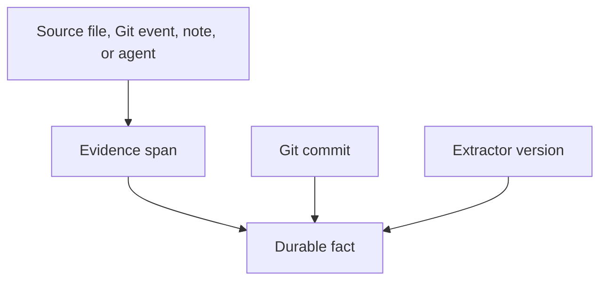

# Provenance

## Purpose

Provenance records where every durable fact came from and why Synapse believes it. It is the foundation for trust, debugging, rollback, and auditability.

## Architecture

## Lifecycle

Every candidate fact receives source metadata before persistence. Derived facts carry transitive provenance back to original evidence.

## Responsibilities

- Store source URI, type, span, hash, and Git commit.
- Track actor and extraction method.
- Preserve evidence counts.
- Support "why do we believe this?" queries.
- Enable trust scoring.

## Data Flow

Provenance travels with semantic objects, graph nodes, graph edges, vector payloads, and context deltas.

## Failure Modes

- Orphaned facts cannot be audited.
- Provenance points to mutable content without a hash.
- Agent-generated facts look equivalent to human notes.
- Redaction removes evidence needed for review.

## Edge Cases

- Facts inferred from multiple files.
- Facts copied through documentation refactors.
- Binary or generated sources.
- Private notes with restricted visibility.

## Scalability Notes

Use compact provenance references in hot tables and store detailed evidence objects content-addressably.

## Security Notes

Provenance can reveal sensitive paths or file names. Apply the same permission model as fact access.

## Performance Considerations

Index provenance by source path, Git commit, fact ID, and trust level.

## Future Extensibility

Support signed provenance records for shared team cognition.

