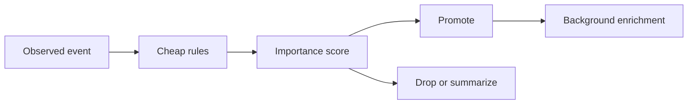

# Relevance Filtering

## Purpose

Relevance filtering protects Synapse from memory bloat. It decides which observations deserve durable cognition.

## Architecture

## Lifecycle

Events are filtered early, before parsing and embedding. Borderline events may be summarized or deferred instead of promoted immediately.

## Responsibilities

- Ignore generated, vendored, and trivial files by default.
- Promote architecture docs, manifests, public APIs, and explicit notes.
- Use path, file type, diff shape, and provenance.
- Keep human notes high priority.
- Record why something was dropped when diagnostic mode is enabled.

## Data Flow

Only promoted semantic units enter extraction and memory indexes. Dropped events may remain as operational diagnostics, not cognition.

## Failure Modes

- Missing important changes due to aggressive filtering.
- Retaining too much low-value churn.
- Hidden filtering decisions confuse users.
- Model cost grows with repository size.

## Edge Cases

- Small one-line changes with large architectural meaning.
- Temporary files that contain important migration notes.
- Rename-only commits.
- Lockfile changes that imply dependency shifts.

## Scalability Notes

Filtering is the first scaling boundary. It must be cheap enough for hot paths and configurable enough for unusual repositories.

## Security Notes

Filtering must not bypass security scanning for high-risk paths such as secrets or permissions files.

## Performance Considerations

Run deterministic rule-based filters before semantic scoring.

## Future Extensibility

Add repository-specific relevance profiles and user-tuned retention policies.

