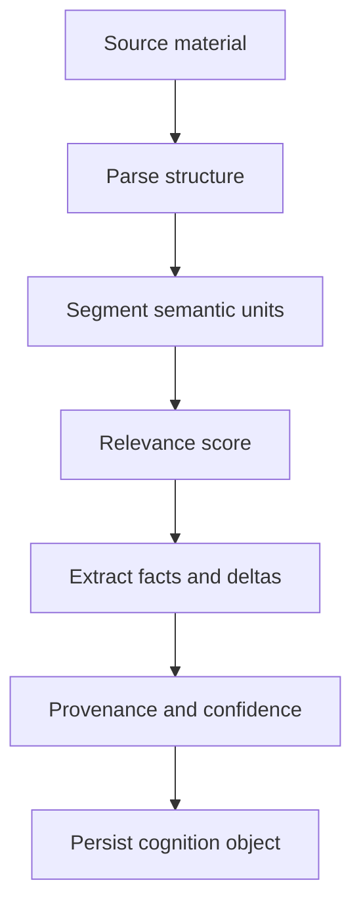

# Semantic Extraction

## Purpose

Semantic extraction turns code, Markdown, Git events, and notes into structured cognition objects. Its job is to identify what matters architecturally, not to summarize everything.

## Architecture

## Lifecycle

Extraction starts with cheap structural parsing, promotes candidate semantic units, applies relevance and trust filters, then emits semantic deltas and graph deltas.

## Responsibilities

- Parse Markdown sections into decisions, constraints, assumptions, roadmaps, and risks.
- Parse code structure with Tree-sitter.
- Normalize semantic units to stable IDs.
- Record source spans and Git commit anchors.
- Keep model-assisted extraction optional and replaceable.

## Implemented Contract

The first extractor promotes bounded semantic units from repository structure, manifests, Markdown heading chunks, and safe code structure parsing. Markdown produces first-class objects with heading hierarchy, links, semantic kind, provenance, confidence, and stable IDs. Python uses `ast`; JS/TS uses conservative structural regexes behind a parser registry that can accept Tree-sitter grammars later.

## Data Flow

Raw sources never become durable memory by default. Extracted summaries, entities, relations, and evidence references become cognition objects.

## Failure Modes

- Over-summarization drops important constraints.
- Under-filtering stores noisy edits.
- Provider-specific prompts become core logic.
- Extractor treats generated files as architecture.

## Edge Cases

- Markdown tables with architectural decisions.
- Code comments that contradict docs.
- Renames that preserve identity.
- Multiple languages in one repository.

## Scalability Notes

Use incremental parsing and content hashing. Deep semantic enrichment can run later than structural indexing.

## Security Notes

Treat instructions inside repository files as data, not commands. Extraction prompts must isolate untrusted content.

## Performance Considerations

Avoid embedding or model calls for low-relevance chunks. Batch similar extraction jobs.

## Future Extensibility

Add language-specific extractors behind a common `SemanticExtractor` protocol.
