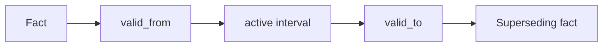

# Temporal Memory

## Purpose

Temporal memory records when facts are valid, superseded, contradicted, or unknown. It prevents stale architecture from masquerading as current truth.

## Architecture

## Lifecycle

Facts begin as candidate observations, become active after relevance and trust checks, receive `valid_from`, and later receive `valid_to` when code, docs, notes, or Git events invalidate them.

## Responsibilities

- Track valid time and transaction time.
- Distinguish stale, contradicted, and superseded facts.
- Preserve historical queries.
- Support branch-specific fact validity.
- Feed drift detection.

## Data Flow

Semantic extraction emits facts with evidence. The temporal engine assigns validity windows based on context DAG position and Git commit anchors.

## Failure Modes

- Facts remain active after refactor.
- Current queries include expired context.
- Branch facts leak across branches.
- Clock time is confused with Git lineage time.

## Edge Cases

- A revert makes an older fact active again.
- Documentation describes intended future architecture.
- Experimental branch introduces temporary design facts.
- A fact is partially true after a split module refactor.

## Scalability Notes

Temporal queries must use indexed validity windows and context-head filters. Avoid scanning all historical facts on every request.

## Security Notes

Expired facts may still be sensitive. Retention and redaction policies apply to history, not only active state.

## Performance Considerations

Store compact interval metadata in SQLite and keep rich evidence in content-addressed objects.

## Future Extensibility

Temporal graph backends such as Neo4j can later store interval-aware relationships while preserving the same validity model.

