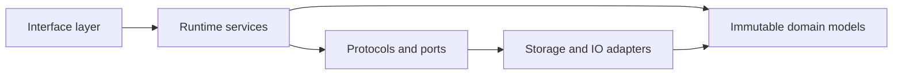

# Coding Standards

## Purpose

These standards keep Synapse predictable as a local runtime with replayable state. Code should make durable cognition changes explicit, typed, idempotent, and easy to audit.

## Architecture

## Lifecycle

New code starts as a small domain model or service contract, receives focused tests, then gains adapters. Interface code should be added after the underlying behavior is stable.

## Responsibilities

- Use strict typing and Pydantic models for boundary data.
- Keep domain objects immutable when they represent cognition.
- Hide IO behind small ports.
- Prefer explicit dependency injection over global runtime state.
- Keep MCP, REST, CLI, and TUI surfaces thin.

## Data Flow

Inputs become events, events become semantic deltas, deltas become immutable context objects, and derived stores update from those objects. Code should follow that direction.

## Failure Modes

- Hidden mutation breaks replay.
- Interface code embeds business logic.
- Provider-specific model code leaks into cognition modules.
- Tests assert implementation details instead of invariants.

## Edge Cases

- Interrupted background jobs must resume safely.
- Duplicate file and Git events must deduplicate.
- Partially unavailable optional services must degrade without corrupting source-of-truth state.

## Scalability Notes

Scale through batching, chunked parsing, lazy enrichment, and cache invalidation. Do not introduce distributed infrastructure before local bottlenecks are measured.

## Security Notes

Never treat agent output as trusted input. Permission checks belong at interface boundaries and durable facts must carry provenance.

## Performance Considerations

Keep hot paths allocation-aware. Avoid parsing or embedding in Git hook paths. Prefer content hashes and cheap metadata checks before expensive semantic work.

## Future Extensibility

Use protocols for graph, vector, model, and parser adapters so NetworkX, Qdrant, and local embedding choices can evolve without rewriting cognition logic.

