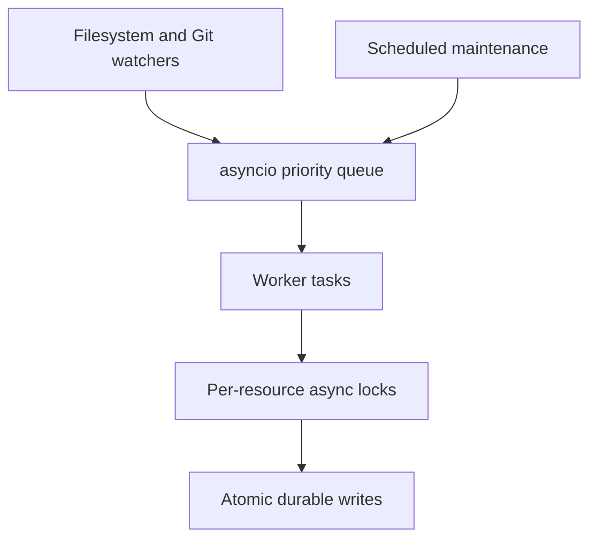

# Concurrency Model

## Purpose

Synapse uses local async concurrency to keep the daemon responsive while indexing, parsing, embedding, compaction, and API requests run in the background.

## Architecture

## Lifecycle

Watchers enqueue lightweight events. Workers claim events, acquire scoped locks, process idempotently, and commit durable changes atomically. Shutdown drains or checkpoints in-flight jobs.

## Responsibilities

- Use bounded queues with backpressure.
- Serialize writes per repository state root.
- Isolate CPU-heavy parsing in executor pools when needed.
- Keep API reads non-blocking.
- Make scheduled maintenance cancel-safe.

## Data Flow

Events move through queue states: observed, claimed, processing, committed, retried, or dead-lettered.

## Failure Modes

- Race between branch checkout and file scan.
- Concurrent workers create duplicate context objects.
- Long embedding job blocks status requests.
- Shutdown drops in-flight events.

## Edge Cases

- Rapid commit bursts.
- Multiple agents querying while compaction runs.
- Watchdog emits duplicate or reordered file events.
- User switches branches during indexing.

## Scalability Notes

Use priority lanes for user-visible commands, Git events, background enrichment, and compaction. Avoid multi-process state mutation until local locking semantics are proven.

## Security Notes

Permission checks must be performed at execution time, not only enqueue time, because branch and trust state can change while jobs wait.

## Performance Considerations

Batch adjacent file events and coalesce repeated updates to the same path before parsing.

## Future Extensibility

The queue contract should support a future durable work queue without changing pipeline semantics.

