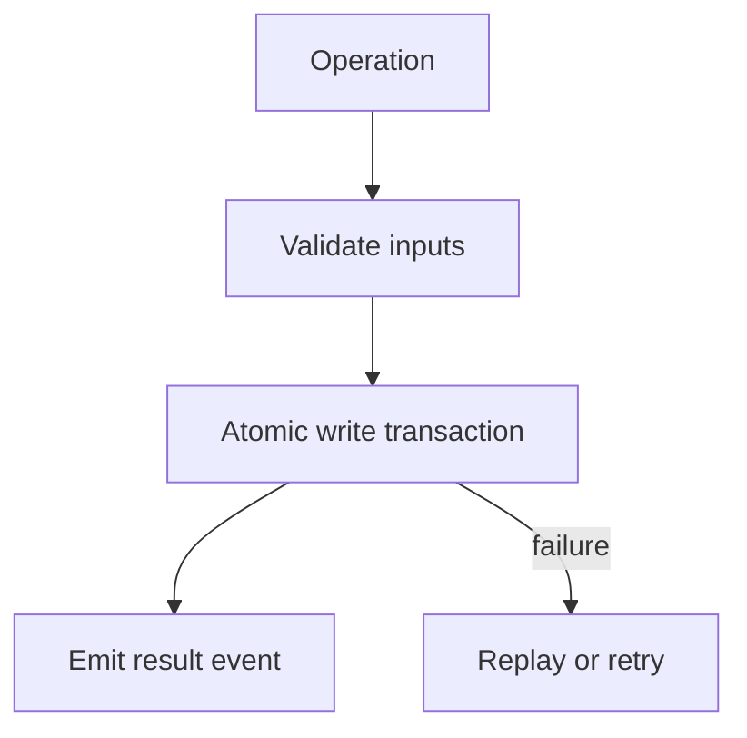

# Error Handling

## Purpose

Synapse should fail visibly and recoverably. Durable state must never be left ambiguous after an exception, crash, or interrupted background job.

## Architecture

## Lifecycle

Errors are classified at boundaries, wrapped with stable domain error types, logged with correlation IDs, and either retried idempotently or surfaced to the user.

## Responsibilities

- Use explicit exception types for storage, parsing, Git, permission, and replay failures.
- Never swallow background worker exceptions silently.
- Use transactions for multi-row durable changes.
- Prefer repair commands over hidden mutation.

## Data Flow

Failed processing attempts become diagnostic events. Successful durable changes become event store records and context objects.

## Failure Modes

- Partial writes across SQLite and object store.
- Retrying non-idempotent jobs.
- Treating parse failure as absence of meaning.
- Repairing derived indexes by editing truth state.

## Edge Cases

- Disk full.
- SQLite locked.
- Object hash collision.
- Git commit missing after rebase.
- Qdrant unavailable.

## Scalability Notes

Retry policy should use bounded backoff and dead-letter queues for poisoned events. Infinite retry loops are forbidden.

## Security Notes

Error messages must not leak secrets, full private content, or unredacted embeddings.

## Performance Considerations

Validation should be cheap and early. Heavy integrity checks belong in `doctor`, replay, or scheduled jobs.

## Future Extensibility

Introduce a structured repair framework once the event and object store APIs stabilize.

