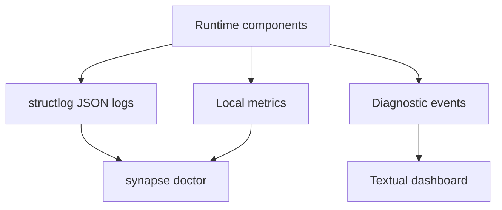

# Observability

## Purpose

Observability makes the local runtime explainable: users should know what Synapse saw, what it stored, what it ignored, and why.

## Architecture

## Lifecycle

Each pipeline stage emits structured logs and diagnostic counters. Long-running jobs emit start, progress, completion, and failure events with correlation IDs.

## Responsibilities

- Use stable event names.
- Include repository, context hash, Git commit, and job ID where available.
- Record relevance-filter decisions at debug level.
- Record trust and permission denials at warning level.
- Keep sensitive content out of logs by default.

## Data Flow

Operational logs go to local files; durable cognition events go to SQLite. Do not confuse observability with memory.

## Failure Modes

- Logs include repository secrets.
- Missing correlation IDs make replay failures hard to debug.
- Metrics become another unbounded storage path.

## Edge Cases

- Runtime crash before log flush.
- User rotates or deletes logs.
- Multiple repositories use the same global log path.

## Scalability Notes

Metrics should be bounded and periodically summarized. External telemetry is out of scope for core operation.

## Security Notes

Default log redaction must handle environment files, keys, tokens, and high-risk local paths.

## Performance Considerations

Structured logging should avoid expensive serialization in hot paths. Debug-level semantic payloads must be opt-in.

## Future Extensibility

Add OpenTelemetry exporters as optional adapters, not as a required runtime dependency.

