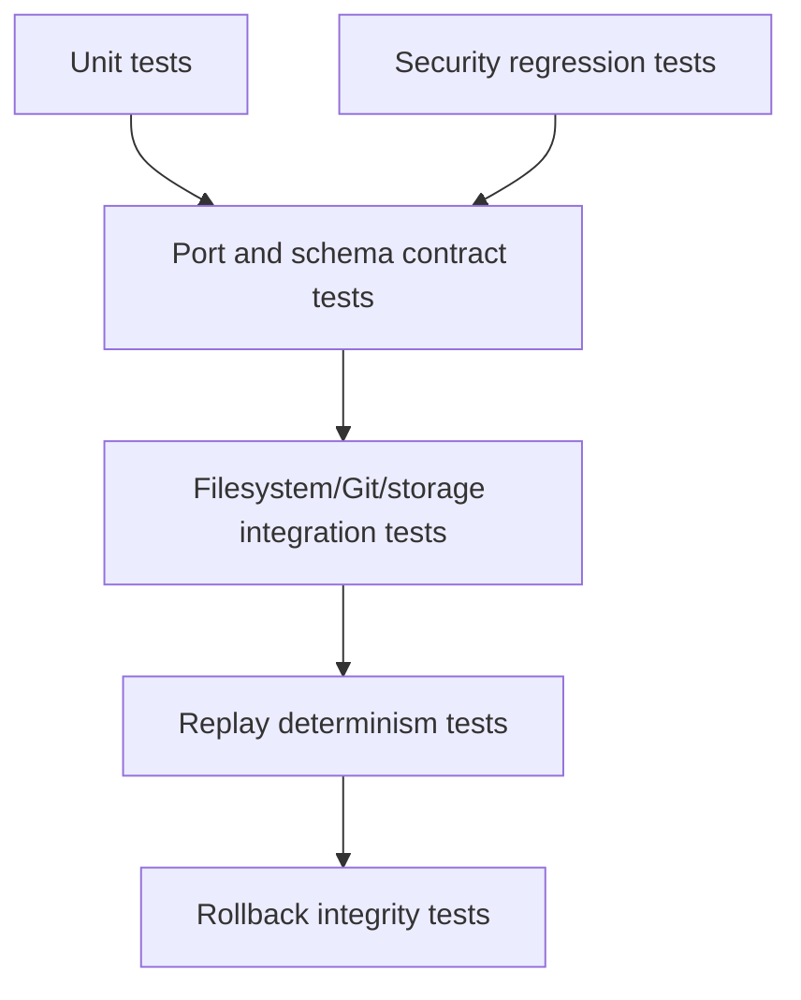

# Testing Strategy

## Purpose

Testing proves that Synapse can reconstruct cognition deterministically, preserve trust boundaries, and survive local runtime failures.

## Architecture

## Lifecycle

Every feature starts with unit tests for pure behavior. Storage, Git, watcher, and MCP behavior add integration tests. Any event, DAG, rollback, or schema change adds replay tests.

## Responsibilities

- Validate event idempotency.
- Validate content-addressed object hashes.
- Validate DAG parentage and active state.
- Validate graph/vector derived state can be rebuilt.
- Validate low-trust input cannot become durable truth without policy approval.

## Data Flow

Test fixtures create isolated temporary repositories, emit events, run the runtime pipeline, then compare reconstructed state to expected context objects and graph facts.

## Failure Modes

- Tests rely on wall-clock order instead of deterministic event order.
- Integration tests leak `.synapse` state between cases.
- Mocked adapters hide serialization or transaction bugs.

## Edge Cases

- Duplicate Git events.
- Rebase or orphaned commit references.
- Corrupted snapshots.
- Interrupted compaction.
- Concurrent note and commit events.

## Scalability Notes

Large-repository tests should use generated fixture trees with configurable file counts and commit depth. Keep them marked separately from fast unit tests.

## Security Notes

Maintain fixtures for malicious Markdown, prompt-injection-like instructions, and untrusted MCP tool payloads.

## Performance Considerations

Track benchmark-style tests for scanning, replay, graph update, and vector update budgets. Do not make performance tests block normal pull requests until budgets are stable.

## Future Extensibility

Add compatibility suites for Neo4j, alternate vector backends, and additional Tree-sitter grammars behind optional test markers.

