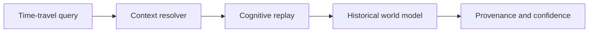

# Architecture Time Travel

## Purpose

Architecture time travel reconstructs what Synapse believed about the system at a prior context, Git commit, branch, or cognitive epoch.

## Architecture

## Lifecycle

A query resolves to a context hash, replays semantic evolution to that point, and returns the active assumptions, confidence samples, and timeline events visible at that context.

## Responsibilities

- Reconstruct historical cognition.
- Explain active and inactive assumptions.
- Preserve branch-specific state.
- Support incident and migration analysis.

## Data Flow

The engine reads event sequences, context DAG ancestry, semantic objects, and object-store hashes to assemble a historical view.

## Failure Modes

- Historical queries accidentally use current facts.
- Snapshot acceleration hides object corruption.
- Branch context leaks across time-travel boundaries.

## Edge Cases

- Detached HEAD contexts.
- Manual note contexts without Git commits.
- Rollback makes an older belief current again.

## Scalability Notes

Use snapshots as replay accelerators, never as the historical truth source.

## Security Notes

Historical states may contain sensitive facts that were later removed. Retention policy must cover time travel.

## Performance Considerations

Start from the nearest verified checkpoint and replay forward once checkpoint-assisted replay exists.

## Future Extensibility

Add cognitive epochs such as pre-auth-rewrite, post-payments-migration, or pre-incident-42.

