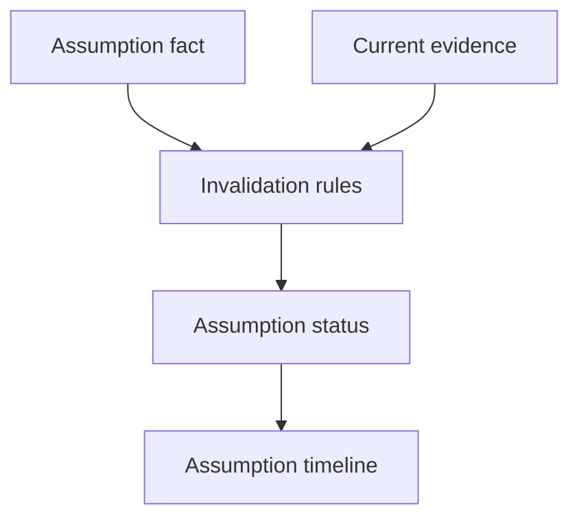

# Assumption Engine

## Purpose

The Assumption Engine tracks explicit and inferred assumptions, then marks them active, stale, invalidated, or superseded as the repository evolves.

## Architecture

## Lifecycle

Assumptions are extracted from Markdown, notes, and future code analysis. The engine checks them against semantic diffs, dependency changes, missing sources, and validity windows.

## Responsibilities

- Track explicit assumptions.
- Track inferred assumptions.
- Detect dependency-based invalidation.
- Preserve invalidation context.
- Support rollback and reactivation through context lineage.

## Data Flow

Assumption semantic objects are indexed in SQLite. The engine compares them across context states and can persist invalidation by closing validity windows.

## Failure Modes

- Assumption text is treated as verified fact.
- Stale assumptions stay active after refactors.
- Invalidation erases historical belief.

## Edge Cases

- A dependency is renamed rather than removed.
- An assumption is intentionally branch-specific.
- A manual note overrides inferred invalidation.

## Scalability Notes

Start with deterministic invalidation rules and add model-assisted review only for high-impact assumptions.

## Security Notes

Assumptions may encode sensitive operating details. Do not expose them broadly through MCP without permission filtering.

## Performance Considerations

Run invalidation against changed dependency and source sets rather than every assumption in history.

## Future Extensibility

Add assumption classes for architectural, operational, security, deployment, and domain assumptions.

