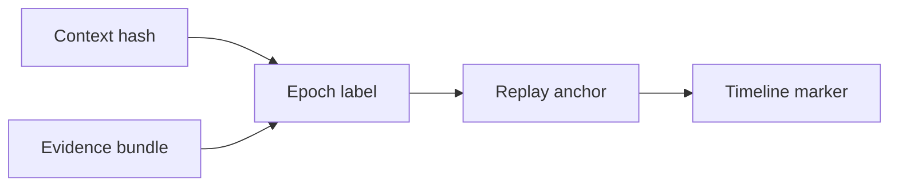

# Cognitive Epochs

## Purpose

Cognitive epochs are named checkpoints in architectural understanding: pre-auth-rewrite, post-event-sourcing migration, pre-incident-42, or post-payments-split.

## Architecture

## Lifecycle

Epochs are created explicitly by users or future policies. They point to context hashes and evidence bundles without replacing append-only event history.

## Responsibilities

- Name important architectural eras.
- Accelerate time-travel queries.
- Support incident and migration analysis.
- Preserve provenance for epoch creation.

## Data Flow

Epoch metadata references context hashes, Git commits, and object-store evidence.

## Failure Modes

- Epoch label points to missing context.
- Epoch becomes treated as truth rather than a named reference.
- Too many auto-generated epochs create noise.

## Edge Cases

- One epoch spans multiple branches.
- Rollback returns to an older epoch.
- Incident epoch includes manual notes and Git commits.

## Scalability Notes

Keep epochs sparse and meaningful. They are landmarks, not per-commit snapshots.

## Security Notes

Epoch names may reveal unreleased initiatives or incidents.

## Performance Considerations

Resolve epochs through indexed context hashes.

## Future Extensibility

Add epoch-aware visualization and temporal query syntax.

