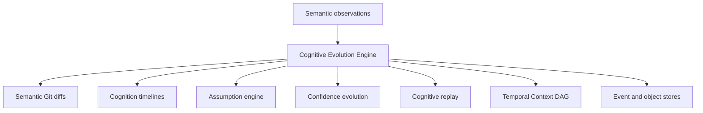

# Cognitive Evolution Engine

## Purpose

The Cognitive Evolution Engine is the heart of Synapse. It turns extracted cognition into temporal system understanding: semantic diffs, timelines, branch divergence, confidence evolution, assumption invalidation, and cognitive replay.

## Architecture

## Lifecycle

Extraction produces bounded semantic observations. The engine compares observations against prior context, creates context commits, computes semantic evolution, updates assumption state, and exposes time-aware queries.

## Responsibilities

- Compare cognition states.
- Generate semantic diffs.
- Build context timelines.
- Track confidence over time.
- Detect branch divergence.
- Coordinate assumption invalidation.
- Replay semantic, architectural, dependency, and trust evolution.

## Data Flow

Repository events become semantic objects. Semantic objects become context commits. Context commits become timeline events and semantic lineage records.

## Failure Modes

- Static graph projection is mistaken for current truth.
- Semantic diff compares only text and misses meaning.
- Confidence values stay static after evidence changes.
- Assumptions remain active after dependencies disappear.

## Edge Cases

- A rollback reactivates older assumptions.
- A branch intentionally diverges from mainline architecture.
- A semantic object changes confidence but not summary.
- A context has no Git commit because it came from a manual note.

## Scalability Notes

The engine should compare affected semantic objects first, then fall back to broader replay. Timelines must be page-limited for large histories.

## Security Notes

Historical cognition can be as sensitive as current cognition. Time-travel queries need the same permission boundaries as current-context queries.

## Performance Considerations

Use context hashes, stable IDs, and event sequence indexes. Do not rebuild all projections for each semantic diff.

## Future Extensibility

Add domain evolution, impact analysis, incident-linked cognition, cognitive epochs, and a temporal query language on this engine rather than in MCP or storage adapters.

