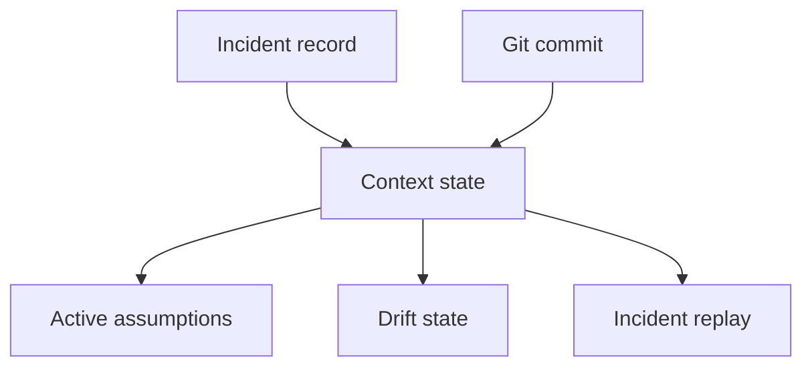

# Incident Cognition

## Purpose

Incident cognition links outages, deployment failures, regressions, and operational events to the architecture state Synapse believed at the time.

## Architecture

## Lifecycle

Incidents start as manual notes or future integrations. Synapse links them to the active context, Git commit, assumptions, drift findings, and confidence state.

## Implemented Contract

`src/synapse/incidents/` creates incident records anchored to the active context head, Git commit, branch, timestamp, and active assumptions. Incident replay delegates to cognitive replay so historical incident analysis does not accidentally use current context.

## Responsibilities

- Capture what the system believed during an incident.
- Link failures to assumptions and architectural drift.
- Support post-incident replay.
- Preserve evidence and provenance.

## Data Flow

Incident objects become semantic objects with context and Git anchors.

## Failure Modes

- Incident notes become trusted facts without review.
- Current context contaminates historical incident reconstruction.
- Sensitive incident details leak through agent tools.

## Edge Cases

- Incident spans multiple commits.
- Incident occurs on an unreleased branch.
- Incident is discovered after the fact.

## Scalability Notes

Keep incident linkage sparse until integrations exist.

## Security Notes

Incidents are high-sensitivity cognition and require explicit access controls.

## Performance Considerations

Incident replay should reuse cognitive replay outputs.

## Future Extensibility

Integrate deployment logs, SLO events, and change-management systems through optional adapters.
