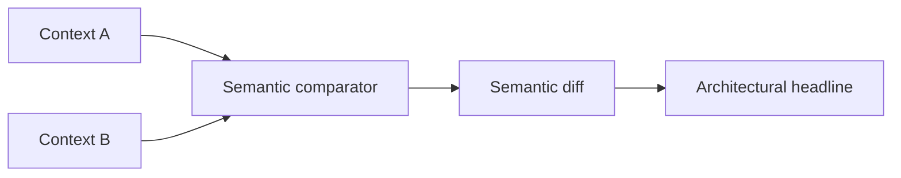

# Semantic Git Diffs

## Purpose

Semantic Git diffs explain what changed cognitively between context commits rather than only what changed textually in files.

## Architecture

## Lifecycle

When a user compares two context hashes, Synapse compares semantic object stable IDs, summaries, kinds, confidence values, provenance, and validity windows.

## Implemented Contract

`src/synapse/impact/` converts semantic diffs into bounded impact findings. The first engine identifies architecture changes, dependency changes, assumption invalidations, and confidence regressions, then emits compact headlines such as authentication trust-model changes or dependency cognition changes.

## Responsibilities

- Detect added, removed, changed, and confidence-shifted cognition.
- Preserve provenance for each changed fact.
- Produce a compact headline.
- Feed assumption invalidation and branch merge review.

## Data Flow

Context rows and semantic indexes are read from SQLite; context object integrity remains verifiable through the object store.

## Failure Modes

- Rename creates false add/remove noise.
- Low-confidence facts dominate the headline.
- Diff ignores validity windows.

## Edge Cases

- Same summary with lower confidence.
- Fact removed on one branch and reintroduced later.
- Manual note changes context without Git file changes.

## Scalability Notes

Diff by stable ID before deeper semantic comparison.

## Security Notes

Diff output can reveal sensitive architecture. Apply the same access policy as context reads.

## Performance Considerations

Keep default diff output bounded and allow drill-down by stable ID.

## Future Extensibility

Add semantic clustering so diffs can say "authentication trust model changed" instead of only listing object IDs.
